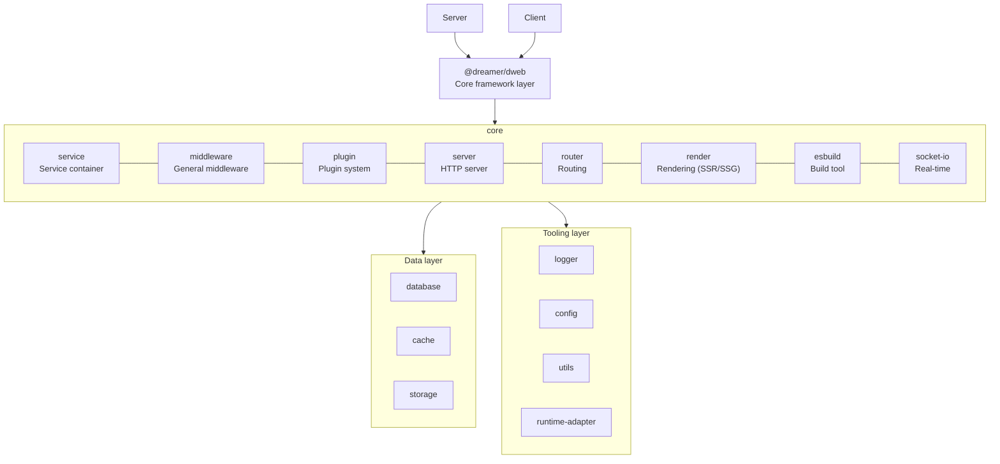
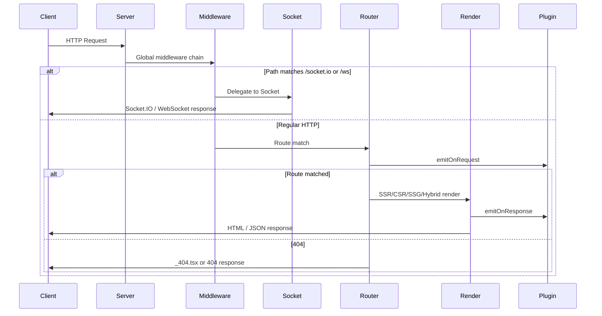

# @dreamer/dweb

> 📖 English | [中文文档](./docs/zh-CN/README.md)

> A full-stack Web framework compatible with Deno and Bun, integrating
> @dreamer/* libraries for an out-of-the-box development experience.

[](https://jsr.io/@dreamer/dweb)
[](./LICENSE)
[](./docs/en-US/TEST_REPORT.md)

---

## 🎯 Overview

A full-stack Web framework similar to Next.js, Remix, and SvelteKit, providing
complete server and client support.

**Three template engines**: The framework supports **View** (recommended),
Preact, and React. **View** is Dweb’s native view layer (`@dreamer/view`):
lightweight, no virtual DOM, fine-grained updates with signals, and first-class
SSR/SSG/CSR/hybrid. See https://github.com/shuliangfu/view for details. Preact
is lightweight and React-compatible; React is fully supported via
`render.engine`.

---

## 📦 Installation

### Install dweb-cli globally

To use `dweb-cli` commands (e.g. `dweb-cli init`, `dweb-cli dev`) from any
directory, run the setup script:

```bash
deno run -A jsr:@dreamer/dweb/setup
```

After installation, run `dweb-cli upgrade` to get the latest version.

After installation, you can run:

```bash
dweb-cli init [appName]   # Initialize new project
dweb-cli dev              # Start dev server
dweb-cli build            # Build for production
dweb-cli start            # Start production server
dweb-cli generate (g)     # Generate code
dweb-cli db migrate (m)   # Database migration
dweb-cli --help           # Full help
```

**Framework options**:

- **View (recommended)**: Dweb’s native view engine—lightweight, no virtual DOM,
  signals + declarative directives; set `render.engine: "view"`
- **Preact**: Lightweight, React-compatible; default in many examples
- **React**: Set `render.engine: "react"` in config
- **Session**: Optional `config.session` (`@dreamer/session`); then
  `ctx.session` in `load()`, API, middleware
- **Render modes**: `render.mode` supports `ssr`, `csr`, `ssg`, `hybrid`

Install standalone libraries as needed (dweb already includes these):

```bash
# Core (dweb depends on these)
deno add jsr:@dreamer/service
deno add jsr:@dreamer/middleware
deno add jsr:@dreamer/plugin
deno add jsr:@dreamer/server
deno add jsr:@dreamer/router
deno add jsr:@dreamer/render
deno add jsr:@dreamer/esbuild
deno add jsr:@dreamer/socket-io

# Data layer (optional)
deno add jsr:@dreamer/database
deno add jsr:@dreamer/cache
deno add jsr:@dreamer/storage

# Tooling (dweb depends on some)
deno add jsr:@dreamer/logger
deno add jsr:@dreamer/config
deno add jsr:@dreamer/utils
deno add jsr:@dreamer/runtime-adapter
```

---

## 🌍 Compatibility

- **Runtimes**: Deno 2.6+ or Bun 1.3.5
- **Server**: ✅ Full support (Deno and Bun)
- **Client**: ✅ Browser (SSR, CSR, SSG, Hybrid)
- **Cross-platform**: ✅ Fully compatible with macOS, Linux, and Windows—works
  out of the box with no extra configuration
- **Dependencies**: Integrates all @dreamer/* libraries

---

## ✨ Features

- ✅ **Full-stack support**: Server + client integrated development
- ✅ **File-based routing**: File-system based routing, similar to Next.js
- ✅ **Multiple render modes**: SSR, CSR, SSG, Hybrid; **in CSR/Hybrid, use
  route `load` to supply data—no manual API requests**; the framework runs
  `load` on the server and passes data to the page via `/__data`
- ✅ **View (recommended)**: Native view engine—lightweight, no virtual DOM,
  signals + declarative directives; Preact and React also supported
- ✅ **Socket.IO built-in**: Real-time bidirectional communication, mounted on
  the same HTTP server; configure `socket: { adapter: "socketio", ... }` to
  enable; supports plugin `onSocket`, `onSocketClose` hooks
- ✅ **Session**: Optional `config.session` (`@dreamer/session`); `ctx.session`
  available in `load()`, API handlers, and middleware for stateful apps
- ✅ **Middleware system**: General-purpose middleware for HTTP, WebSocket,
  message queues, and more
- ✅ **Plugin system**: Plugin lifecycle, dependencies, event system, hot reload
- ✅ **Event system**: App extends EventEmitter, supports lifecycle and custom
  events (on/emit/once/off)
- ✅ **Service container**: Dependency injection and service management
- ✅ **Database support**: Multiple adapters (PostgreSQL, MySQL, SQLite,
  MongoDB); configure `database` to use
- ✅ **Cache**: Install @dreamer/cache for Redis, memory, file cache (dweb does
  not bundle; initialize separately)
- ✅ **Task queue**: Install @dreamer/queue for async tasks, scheduled tasks,
  persistent queues
- ✅ **Unified error handling**: DwebError class with error codes
  (DWEB_E01–E34), i18n, `throwDwebError` / `createDwebError` / `isDwebError` /
  `setDwebErrorTranslator`
- ✅ **Internationalization (i18n)**: Built-in 9 locales (zh-CN, en-US, ja-JP,
  ko-KR, es-ES, pt-BR, id-ID, de-DE, fr-FR); config via `language` or env vars
- ✅ **Type safety**: Full TypeScript support
- ✅ **Developer experience**: HMR (hot module replacement), CLI tools, code
  hints

## Architecture

### Core framework layer (dweb direct dependencies)

1. **@dreamer/service** - Service container (dependency injection)
   - Role: Framework core, manages all services and dependencies
   - Importance: ⭐⭐⭐⭐⭐

2. **@dreamer/middleware** - General-purpose middleware system
   - Role: Middleware chain invocation, error handling, async support
   - Importance: ⭐⭐⭐⭐⭐

3. **@dreamer/plugin** - Plugin management system
   - Role: Plugin lifecycle, plugin dependencies, plugin events
   - Depends on: @dreamer/service
   - Importance: ⭐⭐⭐⭐⭐

4. **@dreamer/server** - HTTP server
   - Role: Handles HTTP requests and responses, integrates routing and rendering
   - Depends on: @dreamer/middleware
   - Importance: ⭐⭐⭐⭐⭐

5. **@dreamer/router** - File-based routing system
   - Role: File-system based route scanning and matching
   - Importance: ⭐⭐⭐⭐⭐

6. **@dreamer/render** - Rendering engine
   - Role: SSR / SSG / CSR / hybrid (View, Preact, React; View recommended)
   - Importance: ⭐⭐⭐⭐⭐

7. **@dreamer/esbuild** - Build tool
   - Role: Server and client code compilation
   - Importance: ⭐⭐⭐⭐⭐

8. **@dreamer/socket-io** - Real-time communication
   - Role: WebSocket real-time bidirectional communication (Socket.IO protocol)
   - Importance: ⭐⭐⭐⭐

9. **@dreamer/session** - Session management
   - Role: Server-side session store and cookie handling; with `config.session`
     set, `ctx.session` is available in `load()`, API handlers, and middleware
   - Importance: ⭐⭐⭐⭐

### Tooling layer

10. **@dreamer/logger** - Logging

- Role: Application log recording
- Importance: ⭐⭐⭐⭐⭐

11. **@dreamer/config** - Config management

- Role: Application config loading and merging
- Importance: ⭐⭐⭐⭐

12. **@dreamer/utils** - Utility functions

- Role: General utilities
- Importance: ⭐⭐⭐⭐

13. **@dreamer/console** - Console / CLI

- Role: CLI output and interaction (command module)
- Importance: ⭐⭐⭐

14. **@dreamer/runtime-adapter** - Runtime adapter

- Role: Unified fs, path, env, cwd APIs for Deno/Bun
- Importance: ⭐⭐⭐⭐⭐

### dweb internal structure (source directory)

| Dir/File   | Description                                                                                                                                                                                                                                                                 |
| ---------- | --------------------------------------------------------------------------------------------------------------------------------------------------------------------------------------------------------------------------------------------------------------------------- |
| `core/`    | Core: app, config, service, middleware, plugin, lifecycle, database, plugin-events, runtime-adapter                                                                                                                                                                         |
| `feature/` | Features: server, router, render, render-ssr, render-csr, render-ssg, render-hybrid, build, csr-client-builder, csr-client-middleware, load-data-middleware (load data and session injection), load-route-module, render-utils, module-cache, socket-io, websocket, command |
| `types/`   | Types: AppConfig, IApp, context (LoadContext, ServerResponse, createMetaContext, createLoadContext, parseCookies, etc.)                                                                                                                                                     |
| `utils/`   | Utilities: logger, version, errors (unified error handling with i18n), cache-dirs, config-loader, i18n, asset-manifest, path, runtime, etc.                                                                                                                                 |
| `cmd/`     | Subcommand implementations: init, dev, build, start, preview, generate, db, upgrade, test, fmt, lint, clean, update                                                                                                                                                         |
| `locales/` | Locale messages (zh-CN, en-US, ja-JP, etc.)                                                                                                                                                                                                                                 |
| `cli.ts`   | CLI entry (createCLI)                                                                                                                                                                                                                                                       |
| `mod.ts`   | Main entry, unified exports                                                                                                                                                                                                                                                 |

### Optional extensions (install as needed)

The following libraries are not bundled in dweb; install separately as needed:

- **@dreamer/database** - Database (PostgreSQL, MySQL, SQLite, MongoDB)
- **@dreamer/cache** - Cache (Redis, memory, file)
- **@dreamer/storage** - File storage
- **@dreamer/queue** - Task queue (requires separate install)
- **@dreamer/websocket** - Native WebSocket (Socket.IO is built into dweb)
- **@dreamer/store** - Client state
- **@dreamer/web3** - Blockchain

## Architecture diagram

The diagram below shows the relationship between dweb layers and core modules.



**Note**: In the data layer, database is built into dweb (configure `database`
to use); cache and storage require separate install of `@dreamer/cache` and
`@dreamer/storage` and manual initialization. AppConfig has no cache config
option.

---

## Request lifecycle and data flow

The complete flow of an HTTP request in dweb is as follows:



### Middleware execution order

1. **Global middleware**: Middlewares registered via `app.use()`, executed in
   registration order
2. **Socket delegation**: If `socket.adapter` is configured, path prefix match
   delegates to Socket.IO or WebSocket
3. **Config middleware**: Middlewares in `config.middlewares`
4. **Route middleware**: Route-level middleware exported from
   `routes/_middleware.ts`
5. **Route matching**: `@dreamer/router` matches based on `routesDir` scan
   results
6. **Plugin events**: `pluginEventsMiddleware` triggers `onRequest`,
   `onResponse`
7. **Rendering**: Selects SSR/CSR/SSG/Hybrid renderer based on `render.mode`

### App initialization flow

```
new App(config)
  → Set DENO_ENV (dev/prod)
  → Initialize ServiceContainer
  → Async _initializeConfig:
      → Load config/main.ts, main.{env}.ts
      → Deep merge config, validate
      → Initialize Logger, Lifecycle, Middleware, Plugin
      → Register plugins, middlewares, route middlewares
      → Initialize Render, Router, Build, Server
      → If socket configured: initialize Socket.IO or WebSocket
      → emit("init")
  → start() waits for _initPromise
  → Lifecycle starting → started
  → Start HTTP server
  → emit("start")
```

---

## 🎯 Use cases

(Single-app, multi-app, full-stack, SSR/CSR/SSG/Hybrid, etc. See "Application
modes" and "Quick start" below.)

## Application modes

@dreamer/dweb supports two application modes:

### Single-app mode (default)

Single App instance, suitable for most scenarios.

### Multi-app mode

Supports multiple apps (e.g. backend, frontend, mobile). Each app runs
independently and can share common code and config.

**Multi-app conventions**:

- **Backend (backend/admin)**: Default **admin panel** form, with pages,
  `_app.tsx`, and route views (e.g. user management, settings).
- **API app**: For **pure API** (no views, no `_app.tsx`, only `routes/api`),
  create a separate app (e.g. app name `api`) distinct from "backend". Templates
  and scaffolding can optionally generate API-only route directories.

---

## 🚀 Quick start

### 1. Create project

Use dweb-cli to create a project (install dweb-cli globally first; see "Install
dweb-cli globally" above):

```bash
dweb-cli init my-app
cd my-app
```

### 2. Project structure

**Directory structure notes**:

- **Default use of `src/` directory** (recommended): The framework uses `src/`
  by default to organize code
- **Optional: no `src/` directory**: If you prefer not to use `src/`, you can
  create files directly in the project root
- All path configs are customizable; specify the correct paths in config
  according to your project structure

#### Single-app mode (default basic)

**Default structure (with src/)**:

```
my-app/
├── src/
│   ├── routes/          # File-based routes
│   │   ├── _app.tsx    # App root component (required; HTML structure goes here)
│   │   ├── _layout.tsx # Layout component
│   │   ├── _404.tsx    # 404 error page
│   │   ├── _error.tsx  # Error page
│   │   ├── _middleware.ts # Route middleware
│   │   ├── index.tsx   # / route
│   │   ├── about.tsx   # /about route
│   │   └── user/
│   │       └── [id].tsx # /user/:id route
│   ├── main.ts         # Server entry
│   └── config/         # Config files
│       ├── main.ts     # Default config
│       └── main.dev.ts # Dev config
└── deno.json
```

**Optional structure (without src/)**:

If you don't want to use `src/`, you can create files directly in the project
root:

```
my-app/
├── routes/             # File-based routes
│   ├── _app.tsx        # App root component (required)
│   ├── _layout.tsx     # Layout component
│   ├── index.tsx       # / route
│   └── about.tsx       # /about route
├── main.ts             # Server entry
├── config/             # Config files
│   ├── main.ts         # Default config
│   └── main.dev.ts     # Dev config
└── deno.json
```

**Note**: If you don't use `src/`, update paths in config to `"./routes"`,
`"./main.ts"`, etc.

#### Multi-app mode advanced

**Default structure (with src/)**:

```
my-app/
├── src/
│   ├── backend/         # Admin app (default with pages, _app.tsx, route views)
│   │   ├── main.ts     # Backend entry
│   │   ├── routes/     # Backend routes (pages + optional api)
│   │   │   ├── _app.tsx
│   │   │   ├── index.tsx
│   │   │   └── api/    # Optional API routes
│   │   └── config/     # Backend config
│   │       ├── main.ts
│   │       └── main.dev.ts
│   ├── frontend/       # Frontend app
│   │   ├── main.ts     # Frontend entry
│   │   ├── routes/     # Frontend routes (page routes)
│   │   │   ├── _app.tsx
│   │   │   ├── index.tsx
│   │   │   └── about.tsx
│   │   └── config/     # Frontend config
│   │       ├── main.ts
│   │       └── main.dev.ts
│   └── common/          # Shared code and config
│       ├── config/     # Shared config
│       │   ├── main.ts     # Shared default config
│       │   └── main.dev.ts # Shared dev config
│       ├── services/   # Shared services
│       ├── utils/      # Shared utilities
│       └── types/      # Shared types
└── deno.json
```

**Optional structure (without src/)**:

If you don't want to use `src/`, you can create files directly in the project
root:

```
my-app/
├── backend/            # Admin (with pages, _app.tsx)
│   ├── main.ts
│   ├── routes/
│   └── config/
├── frontend/           # Frontend app
│   ├── main.ts
│   ├── routes/
│   └── config/
├── api/                # Optional: pure API app (no _app.tsx, only routes/api)
│   ├── main.ts
│   ├── routes/api/
│   └── config/
├── mobile/             # Mobile app (optional)
│   ├── main.ts
│   ├── routes/
│   └── config/
├── common/             # Shared code and config
│   ├── config/
│   ├── services/
│   ├── utils/
│   └── types/
└── deno.json
```

**Note**: If you don't use `src/`, update paths in config to
`"./backend/routes"`, `"./frontend/routes"`, etc.

**Special file handling**:

All special files (`_app.tsx`, `_layout.tsx`, `_404.tsx`, `_error.tsx`,
`_middleware.ts`) are handled by **`@dreamer/router`**:

- **`@dreamer/router` is responsible for**:
  - Scanning and identifying special files (files starting with `_`)
  - Handling `_app.tsx`: as app root component, generates HTML structure
  - Handling `_layout.tsx`: as layout component, wraps all route pages
  - Handling `_404.tsx`: used when no route matches
  - Handling `_error.tsx`: used when an error occurs
  - Handling `_middleware.ts`: route-level middleware, runs before route
    matching
  - Auto-generating client entry code (based on `_app.tsx` and route files)
  - Handling SSR rendering and client hydration

- **Workflow**:
  1. `@dreamer/router` scans `routes/` directory
  2. Identifies special files and normal route files
  3. Generates HTML structure from `_app.tsx`
  4. Generates route config from route files
  5. Auto-generates client entry code (React/Preact/View init, routing,
     hydration)
  6. `@dreamer/esbuild` compiles using the auto-generated entry

**Client entry files `_client.tsx` and `_client.dep.tsx`** (both
auto-generated):

- **`_client.tsx`**: Generated only when it does not exist; **once present it is
  never overwritten**, so you can customize the entry if needed.
- **`_client.dep.tsx`**: **Regenerated every time you run `dweb dev`**, so it
  stays in sync with current routes and layouts; it is also generated on build
  when needed.

### 3. Create app

#### Single-app mode

```typescript
// src/main.ts
import { App } from "jsr:@dreamer/dweb";

// Create single App instance (default mode)
const app = new App({
  name: "my-app",
  version: "1.0.0",

  // Server config
  server: {
    port: 3000,
    host: "localhost",
  },

  // Render config (engine: preact | react; mode: ssr | csr | ssg | hybrid)
  render: {
    engine: "preact",
    mode: "ssr",
  },

  // Router config (file-system based)
  router: {
    routesDir: "./src/routes",
  },

  // Logger config
  logger: {
    level: "info",
  },

  // Build config
  build: {
    server: {
      entry: "src/main.ts",
      output: "dist",
    },
  },
});

// Global middleware
app.use(async (_req, _res, next) => {
  console.log(`${_req.method} ${_req.url}`);
  await next();
});

// Start app
await app.start();
```

**Single-app mode characteristics**:

- ✅ Single App instance
- ✅ All features in one app
- ✅ Suitable for most scenarios
- ✅ Simple and straightforward

**Single-app mode config**:

```typescript
// deno.json
{
  "tasks": {
    // Dev (default uses src/)
    "dev": "deno run --allow-all src/main.ts",
    // Without src/: "deno run --allow-all main.ts"

    // Build
    "build": "deno run -A src/main.ts --build",

    // Production (run built version)
    "start": "deno run --allow-all dist/server.js",

    // Other
    "test": "deno test",
    "fmt": "deno fmt",
    "lint": "deno lint"
  }
}
```

**Path config notes**:

- **Default with `src/`**: Framework defaults to `./src/main.ts`,
  `./src/routes`, etc.
- **Without `src/`**: Use `./main.ts`, `./routes`, etc.
- Specify correct paths in config according to your project structure

**How to run**:

- **Dev**: `deno task dev` - start dev server
- **Production**:
  1. Build: `deno task build` - build for production
  2. Start: `deno task start` - run built version

#### Multi-app mode

```typescript
// src/backend/main.ts (admin: with _app.tsx, page routes)
import { App } from "jsr:@dreamer/dweb";
import { loadCommonConfig } from "../common/config/main.ts";

const backendApp = new App({
  name: "backend",
  ...loadCommonConfig(),
  server: { port: 3000, host: "localhost" },
  router: { routesDir: "./src/backend/routes" },
  render: { engine: "preact", mode: "ssr" },
});

backendApp.use("/api", async (_req, _res, next) => await next());
await backendApp.start();
```

```typescript
// src/frontend/main.ts
import { App } from "jsr:@dreamer/dweb";
import { loadCommonConfig } from "../common/config/main.ts";

const frontendApp = new App({
  name: "frontend",
  ...loadCommonConfig(),
  server: { port: 3001, host: "localhost" },
  router: { routesDir: "./src/frontend/routes" },
  render: { engine: "preact", mode: "hybrid" },
});

await frontendApp.start();
```

```typescript
// src/mobile/main.ts
import { App } from "jsr:@dreamer/dweb";
import { loadCommonConfig } from "../common/config/main.ts";

const mobileApp = new App({
  name: "mobile",
  ...loadCommonConfig(),
  server: { port: 3002, host: "localhost" },
  router: { routesDir: "./src/mobile/routes" },
  render: { engine: "preact", mode: "csr" },
});

await mobileApp.start();
```

**Multi-app mode characteristics**:

- ✅ Multiple independent App instances
- ✅ Each app has its own main.ts and config
- ✅ Can share common code and config (common directory)
- ✅ Suitable for large projects, frontend/backend separation
- ✅ Backend (backend/admin) default has pages, _app.tsx; for pure API (no
  views) create a separate app (e.g. `api`, only routes/api)

#### Common config and code

```typescript
// src/common/config/main.ts (default uses src/)
// Shared config for all apps
// Use @dreamer/runtime-adapter getEnv for Deno/Bun compatibility
import { getEnv } from "jsr:@dreamer/runtime-adapter";

export function loadCommonConfig() {
  return {
    database: {
      default: {
        adapter: "postgresql",
        connection: {
          host: getEnv("DB_HOST") || "localhost",
          port: parseInt(getEnv("DB_PORT") || "5432"),
          database: getEnv("DB_NAME") || "mydb",
          username: getEnv("DB_USER") || "user",
          password: getEnv("DB_PASSWORD") || "password",
        },
      },
    },
    // Other shared config (for @dreamer/cache, install separately and init manually)
  };
}
```

```typescript
// src/common/config/main.dev.ts (default uses src/)
// Shared dev config
import { loadCommonConfig } from "./main.ts";

export function loadCommonDevConfig() {
  return {
    ...loadCommonConfig(),
    // Dev-specific
    debug: true,
    logLevel: "debug",
  };
}
```

**Multi-app mode config and startup**:

```typescript
// deno.json
{
  "tasks": {
    // Dev (default uses src/)
    "dev:backend": "deno run --allow-all src/backend/main.ts",
    "dev:frontend": "deno run --allow-all src/frontend/main.ts",
    "dev:mobile": "deno run --allow-all src/mobile/main.ts",
    // Without src/:
    // "dev:backend": "deno run --allow-all backend/main.ts",
    // "dev:frontend": "deno run --allow-all frontend/main.ts",
    // "dev:mobile": "deno run --allow-all mobile/main.ts",

    // Build
    "build:backend": "deno run -A src/backend/main.ts --build",
    "build:frontend": "deno run -A src/frontend/main.ts --build",
    "build:mobile": "deno run -A src/mobile/main.ts --build",

    // Production (run built version)
    "start:backend": "deno run --allow-all dist/backend/server.js",
    "start:frontend": "deno run --allow-all dist/frontend/server.js",
    "start:mobile": "deno run --allow-all dist/mobile/server.js"
  }
}
```

**Path config notes**:

- **Default with `src/`**: Framework defaults to `src/backend/main.ts`,
  `src/frontend/main.ts`, etc.
- **Without `src/`**: Use `backend/main.ts`, `frontend/main.ts`, etc.
- Specify correct paths in config according to your project structure

**How to run**:

**Dev**:

- Start separately: `deno task dev:backend`, `deno task dev:frontend`,
  `deno task dev:mobile`
- Each app runs on its own port
- Can start only the apps you need

**Production**:

1. Build: `deno task build:backend`, `deno task build:frontend`,
   `deno task build:mobile`
2. Start built version: `deno task start:backend`, `deno task start:frontend`,
   `deno task start:mobile`
3. Each app runs on its own port
4. Can start only the apps you need

### 4. Create routes and special files

#### App root component (required)

```typescript
// src/routes/_app.tsx (default uses src/)
// App root component; HTML structure goes here
// All client init logic can be handled here

import { useEffect } from "preact/hooks";
// Use @dreamer/store for state (recommended)
import { createStore } from "jsr:@dreamer/store";
// Or Signals: import { signal } from "jsr:@dreamer/store";
import { Analytics } from "./analytics"; // Third-party lib

// Create global state with @dreamer/store (recommended)
interface UserStore {
  user: { name: string; isAuthenticated: boolean } | null;
  setUser: (user: UserStore["user"]) => void;
}

const useUserStore = createStore<UserStore>((set) => ({
  user: null,
  setUser: (user) => set({ user }),
}));

export default function App(
  { children }: { children: preact.ComponentChildren },
) {
  // Client init (runs only on client)
  useEffect(() => {
    // 1. Global state init - @dreamer/store needs no Provider
    // 2. Third-party init
    Analytics.init({ apiKey: "your-api-key" });
    // 3. Global event listeners
    const handleResize = () => {};
    globalThis.addEventListener("resize", handleResize);
    // 4. Performance monitoring
    if (typeof globalThis !== "undefined") {
      console.log("Client app initialized");
    }
    return () => {
      globalThis.removeEventListener("resize", handleResize);
    };
  }, []);

  return (
    <html lang="en">
      <head>
        <meta charSet="UTF-8" />
        <meta name="viewport" content="width=device-width, initial-scale=1.0" />
        <title>My App</title>
      </head>
      <body>
        <div id="root">{children}</div>
      </body>
    </html>
  );
}
```

**Custom client init notes**:

All of the following can be handled in `_app.tsx` (the framework uses
auto-generated `_client.dep.tsx` as the client entry; no separate client entry
file to maintain):

1. **Global state**: Use `@dreamer/store` (Store or Signals); or other
   Preact-compatible libs
2. **Third-party init**: Analytics, monitoring, UI libs in `useEffect`
3. **Global config**: Theme, i18n, global styles
4. **Client-only logic**: localStorage, event listeners, performance monitoring
   in `useEffect`

**Note**: The framework auto-generates `_client.dep.tsx` (and related client
entry); `_app.tsx` is the root component for hydration and CSR. Put custom
client logic in `_app.tsx`; `useEffect` runs only on the client and does not
affect SSR.

#### Layout component

```typescript
// src/routes/_layout.tsx (default uses src/)
// Global layout; all routes use this layout
export default function Layout(
  { children }: { children: preact.ComponentChildren },
) {
  return (
    <div>
      <header>
        <nav>
          <a href="/">Home</a>
          <a href="/about">About</a>
        </nav>
      </header>
      <main>{children}</main>
      <footer>© 2024 My App</footer>
    </div>
  );
}
```

#### 404 page

```typescript
// src/routes/_404.tsx (default uses src/)
// Shown when no route matches
export default function NotFound() {
  return (
    <div>
      <h1>404 - Page Not Found</h1>
      <p>Sorry, the page you requested does not exist.</p>
      <a href="/">Back to Home</a>
    </div>
  );
}
```

#### Error page

```typescript
// src/routes/_error.tsx (default uses src/)
// Shown when an error occurs
export default function Error({ error }: { error?: Error }) {
  return (
    <div>
      <h1>Error</h1>
      <p>{error?.message || "An unknown error occurred"}</p>
      <a href="/">Back to Home</a>
    </div>
  );
}
```

#### Route middleware

```typescript
// src/routes/_middleware.ts (default uses src/)
// Route-level middleware; runs before route matching
export default function middleware(req: Request) {
  const token = req.headers.get("authorization");
  if (!token && req.url.includes("/admin")) {
    return new Response(null, {
      status: 302,
      headers: { Location: "/login" },
    });
  }
  return null; // Continue
}
```

#### Normal routes

```typescript
// src/routes/index.tsx (default uses src/)
export default function Home() {
  return (
    <div>
      <h1>Welcome to Dreamer Framework</h1>
    </div>
  );
}
```

```typescript
// src/routes/user/[id].tsx (default uses src/)
export default function User({ params }: { params: { id: string } }) {
  return (
    <div>
      <h1>User ID: {params.id}</h1>
    </div>
  );
}
```

#### CSR / Hybrid: use `load` for data—no manual API requests

In **CSR** and **Hybrid** modes, you **do not need to write API requests** in
your pages (e.g. `fetch("/api/xxx")`). Export a **`load`** function in the route
file that returns the data; the framework runs it on the server and passes the
return value to the page component as **props**.

- **First paint**: The server runs the current route’s `load()` and injects the
  result into the page (or, in CSR, into `globalThis.__DATA__` for the client).
- **Client-side navigation**: When changing routes, the framework automatically
  requests `GET /__data?path=...`; the server runs that route’s `load()` and
  returns JSON, which becomes the page props—no manual `fetch` in your code.

You only need to **implement `load` and return the data**; the page receives it
via props.

```typescript
// src/routes/users/index.tsx
import type { LoadContext } from "jsr:@dreamer/dweb/types";

/** Framework runs load on the server; in CSR/Hybrid the client gets this via /__data—no manual fetch */
export async function load(ctx: LoadContext) {
  const list = await getUsersFromDb(ctx);
  return { list };
}

export default function Users(
  { list }: { list: { id: string; name: string }[] },
) {
  return (
    <div>
      <h1>User list</h1>
      <ul>{list.map((u) => <li key={u.id}>{u.name}</li>)}</ul>
    </div>
  );
}
```

### Special files reference

| File             | Description      | Required | Role                                                  |
| ---------------- | ---------------- | -------- | ----------------------------------------------------- |
| `_app.tsx`       | App root         | ✅       | Defines HTML structure; all pages are wrapped in this |
| `_layout.tsx`    | Layout           | ❌       | Global layout for all routes                          |
| `_404.tsx`       | 404 page         | ❌       | Shown when no route matches                           |
| `_error.tsx`     | Error page       | ❌       | Shown when an error occurs                            |
| `_middleware.ts` | Route middleware | ❌       | Route-level middleware; runs before route matching    |

**File rules**:

- Files starting with `_` are special and do not generate routes
- `_app.tsx` is required for HTML structure
- Other special files are optional

**Route naming**:

| Pattern         | Example                     | Path                     |
| --------------- | --------------------------- | ------------------------ |
| `index.tsx`     | `routes/index.tsx`          | `/`                      |
| `about.tsx`     | `routes/about.tsx`          | `/about`                 |
| `[id].tsx`      | `routes/user/[id].tsx`      | `/user/:id`              |
| `[...slug].tsx` | `routes/docs/[...slug].tsx` | `/docs/*`                |
| `api/*.ts`      | `routes/api/users.ts`       | `/api/users` (API route) |

**Page routes** (hydratable UI) are registered only for **`.tsx`** and
**`.jsx`** under **`routes/`**. **`.ts`** and **`.js`** files in that tree
(outside **`api/`**) are not treated as pages and are not added to the client
lazy-load map — use them for shared helpers or constants. **API routes** (path
contains an **`api/`** segment) may still use **`.ts`**, **`.js`**, **`.tsx`**,
or **`.jsx`** as handlers. Route components can `import "*.css"`; the framework
strips and injects styles.

**Handling**:

All special files are handled by **`@dreamer/router`**:

1. **Scan**: Identifies files starting with `_`
2. **Special handling**: `_app.tsx` (root), `_layout.tsx` (layout), `_404.tsx`,
   `_error.tsx`, `_middleware.ts`
3. **Client code**: `@dreamer/router` auto-generates client entry from
   `_app.tsx` and routes. **`_client.tsx`** and **`_client.dep.tsx`** are both
   auto-generated: `_client.tsx` is created only when missing and never
   overwritten; `_client.dep.tsx` is regenerated on every `dweb dev` start
4. **Build**: `@dreamer/esbuild` uses the auto-generated entry

---

## 🎨 Examples

### Event system

App extends **EventEmitter**. You can listen or emit at lifecycle points or for
custom business events.

| Method                         | Description                   |
| ------------------------------ | ----------------------------- |
| `app.on(eventName, handler)`   | Listen; can register multiple |
| `app.once(eventName, handler)` | Fire once then remove         |
| `app.emit(eventName, ...args)` | Emit; can pass args           |
| `app.off(eventName, handler)`  | Remove listener               |

**Built-in events** (emitted by the framework):

| Event   | When                                                       |
| ------- | ---------------------------------------------------------- |
| `init`  | App init done (config, services, routes ready)             |
| `start` | App started (inside `await app.start()`, before lifecycle) |
| `stop`  | App stopped (inside `await app.stop()`)                    |
| `build` | Build done (after `await app.build()`)                     |
| `error` | Uncaught error (can also `app.emit("error", err)`)         |

**Custom events**: Any name; use `emit` freely.

```typescript
import { App } from "jsr:@dreamer/dweb";

const app = new App({ name: "my-app", version: "1.0.0" /* ... */ });

app.on("init", () => {
  console.log("App initialized; container, config, etc. are ready");
});

app.on("start", () => {
  console.log("App started; server listening");
});

app.on("build", () => {
  console.log("Build done; can run deploy scripts");
});

app.once("init", () => {
  console.log("Runs only on first init");
});

app.on("user:login", (userId: string) => {
  console.log("User logged in:", userId);
});
// Somewhere: app.emit("user:login", "123");
```

**Difference from plugin hooks**: Plugin `onInit`, `onStart`, `onStop` are from
the **plugin event system** (`@dreamer/dweb/core/plugin-events`) for plugin
logic. App `init`, `start`, `stop` are **EventEmitter events** for app-level
logging, monitoring, or decoupling.

### Middleware system

```typescript
import { App } from "jsr:@dreamer/dweb";

const app = new App({ ... });

// Global middleware
app.use(async (req, res, next) => {
  console.log(`${req.method} ${req.url}`);
  await next();
});

// Path-prefix middleware
app.use("/api", async (req, res, next) => {
  // Only for /api paths
  await next();
});

// Error-handling middleware
app.useError(async (req, res, error, next) => {
  console.error("Error:", error);
  res.status(500).json({ error: "Internal Server Error" });
});
```

### Plugin system

Plugins only need `name`, `version`, and event hooks (e.g. `onInit`); no
`install`/`activate`. Configure in `config.plugins`; the framework handles
register→install→activate.

**Plugin lifecycle hooks**:

| Hook              | When                                      |
| ----------------- | ----------------------------------------- |
| `onInit`          | App init done; config and container ready |
| `onStart`         | App starting; server about to listen      |
| `onStop`          | App stopped                               |
| `onShutdown`      | Before app shutdown                       |
| `onRequest`       | On each HTTP request                      |
| `onResponse`      | Before each HTTP response                 |
| `onSocket`        | Socket connected (Socket.IO / WebSocket)  |
| `onSocketClose`   | Socket disconnected                       |
| `onRoute`         | Route scan done; can inspect route list   |
| `onBuild`         | Build started                             |
| `onBuildComplete` | Build done                                |
| `onError`         | On error                                  |
| `onHealthCheck`   | On health check                           |
| `onHotReload`     | On HMR hot reload                         |

```typescript
// Method 1: via config.plugins (recommended)
const config = {
  plugins: [
    {
      name: "auth-plugin",
      version: "1.0.0",
      dependencies: ["database-plugin"],
      async onInit(container) {
        container.registerSingleton("authService", () => new AuthService());
        const authService = container.get("authService");
        await authService.initialize();
      },
    },
  ],
};

// Method 2: manual register (must install/activate yourself)
import { getPluginManager } from "jsr:@dreamer/dweb";

const pluginManager = getPluginManager(app.container);
await pluginManager.register({
  name: "auth-plugin",
  version: "1.0.0",
  dependencies: ["database-plugin"],
  async onInit(container) {
    container.registerSingleton("authService", () => new AuthService());
    const authService = container.get("authService");
    await authService.initialize();
  },
});
await pluginManager.install("auth-plugin");
await pluginManager.activate("auth-plugin");
```

**Socket plugin events**: When `socket.adapter` (`socketio` or `websocket`) is
configured, the framework calls `onSocket` and `onSocketClose` on
connect/disconnect for auth, logging, etc.:

```typescript
{
  name: "socket-auth-plugin",
  version: "1.0.0",
  async onSocket(ctx, container) {
    // ctx = Socket.IO or WebSocket socket context
    // Called on connect; can do auth, logging, etc.
  },
  async onSocketClose(ctx, container) {
    // Called on disconnect
  },
}
```

### Database operations

The framework bundles `@dreamer/database`. Configure `config.database` and get
it from the container:

```typescript
// Get database from container
const db = app.container.get("database");

// Query
const users = await db.table("users")
  .select("id", "name", "email")
  .where("age", ">", 18)
  .orderBy("created_at", "desc")
  .limit(10)
  .execute();

// Insert
await db.table("users").insert({
  name: "Alice",
  email: "alice@example.com",
  age: 30,
});

// Transaction
await db.transaction(async (trx) => {
  await trx.table("users").insert({ name: "Bob" });
  await trx.table("orders").insert({ user_id: 1, amount: 100 });
});
```

### Config management

Two kinds of config: **framework config** (`config/main.ts`) and **business
config** (`config/params.ts`). Use `app.container` to access them in main.ts,
plugins, middleware, API routes, etc.

#### 1. Framework config (config/main.ts)

From `config/main.ts`, `config/main.{env}.ts` (e.g. `main.dev.ts`); merged into
`AppConfig`.

```typescript
import { getConfig, getConfigManager, getConfigValue } from "jsr:@dreamer/dweb";

const container = app.container;

// Full AppConfig
const config = getConfig(container);
console.log(config.name, config.server?.port, config.database);

// Single value by dot path ("server.port", "database.default.host", etc.)
const port = getConfigValue<number>(container, "server.port", 3000);
const dbHost = getConfigValue<string>(
  container,
  "database.default.connection.host",
  "localhost",
);

// ConfigManager (envPrefix, hot reload, etc.)
const configManager = getConfigManager(container);
const value = configManager.get("custom.key", "default");
```

#### 2. Business config (config/params.ts)

From `config/params.ts`; for feature flags, API URLs, pagination, timeouts, etc.
Separate from framework config.

**params.ts example**:

```typescript
// config/params.ts
export default {
  features: {
    enablePay: true,
    maxUploadSize: 10 * 1024 * 1024,
  },
  api: {
    externalUrl: "https://api.example.com",
    timeout: 30000,
  },
  pagination: {
    defaultPageSize: 20,
    maxPageSize: 100,
  },
};
```

**Access**:

```typescript
import { getParams, getParamValue } from "jsr:@dreamer/dweb";

const container = app.container;

const params = getParams(container);

const enablePay = getParamValue<boolean>(
  container,
  "features.enablePay",
  false,
);
const timeout = getParamValue<number>(container, "api.timeout", 30000);
const pageSize = getParamValue<number>(
  container,
  "pagination.defaultPageSize",
  20,
);
```

#### 3. Environment variables (two ways)

**Via Config (recommended, no runtime-adapter)**:

With `envPrefix`, ConfigManager merges prefixed env vars into config. Use
`getConfigValue` or `getConfigManager().get()`; no need for
`@dreamer/runtime-adapter`.

```typescript
// AppConfig: envPrefix: "APP_"
const app = new App({
  envPrefix: "APP_",
  // ...
});

// APP_PORT, APP_SERVER_HOST, APP_DATABASE_HOST, etc. merged into config
// APP_SERVER_PORT -> server.port, APP_DATABASE_HOST -> database.host (underscore to nested)
const port = getConfigValue<string>(container, "server.port", "3000");
const host = getConfigValue<string>(container, "server.host", "127.0.0.1");
const dbHost = getConfigValue<string>(container, "database.host", "localhost");
```

**Env var naming** (with `envPrefix: "APP_"`):

| Env var                       | Config key                |
| ----------------------------- | ------------------------- |
| `APP_PORT`                    | `port`                    |
| `APP_SERVER_PORT`             | `server.port`             |
| `APP_DATABASE_HOST`           | `database.host`           |
| `APP_DATABASE_CONNECTION_URL` | `database.connection.url` |

**Direct env read (with runtime-adapter)**:

When **defining** config in `config/main.ts`, or for **unprefixed** env vars,
use `getEnv`:

```typescript
import { getEnv } from "jsr:@dreamer/runtime-adapter";

const dbHost = getEnv("DB_HOST") ?? "localhost";
const port = parseInt(getEnv("PORT") ?? "3000");
```

**In config/main.ts** (Config not loaded yet; use getEnv):

```typescript
// config/main.ts
import type { AppConfig } from "jsr:@dreamer/dweb";
import { getEnv } from "jsr:@dreamer/runtime-adapter";

export default {
  name: "my-app",
  version: "1.0.0",
  envPrefix: "APP_",
  server: {
    port: parseInt(getEnv("PORT") ?? "3000"),
    host: getEnv("HOST") ?? "127.0.0.1",
  },
  database: {
    default: {
      adapter: "postgresql",
      connection: {
        host: getEnv("DB_HOST") ?? "localhost",
        port: parseInt(getEnv("DB_PORT") ?? "5432"),
        database: getEnv("DB_NAME") ?? "mydb",
        username: getEnv("DB_USER") ?? "user",
        password: getEnv("DB_PASSWORD") ?? "",
      },
    },
  },
} satisfies AppConfig;
```

**Summary**: Prefer `getConfigValue` / `getConfigManager().get()` at runtime
(includes env vars). Use `getEnv` only when defining config or for unprefixed
env vars.

#### 4. Config load order

| Priority | File                         | Description                      |
| -------- | ---------------------------- | -------------------------------- |
| Low      | `common/config/main.ts`      | Shared (multi-app)               |
| Mid      | `config/main.ts`             | Base config                      |
| Mid      | `config/main.{env}.ts`       | Env override (main.dev.ts, etc.) |
| High     | Config passed to `new App()` | Overrides                        |

`params.ts` loads separately; stored under `params`; use `getParams` /
`getParamValue`.

#### 5. Config directory and files

| File                   | Description                       | Loaded when         |
| ---------------------- | --------------------------------- | ------------------- |
| `config/main.ts`       | Base config, shared across envs   | App init            |
| `config/main.{env}.ts` | Env override (main.dev.ts, etc.)  | By DENO_ENV/BUN_ENV |
| `config/params.ts`     | Business params (flags, API URLs) | With main series    |

**Config dir**: Inferred from entry path (e.g. `src/backend/main.ts` →
`src/backend/config`); fallback `./config`, `./src/config`.

### Data validation

```typescript
import { number, object, string, validate } from "jsr:@dreamer/utils/validator";

const schema = object({
  name: string().min(2).required(),
  email: string().email().required(),
  age: number().min(18).max(100).required(),
});

const result = validate(req.body, schema);
if (!result.success) {
  return res.status(400).json({ errors: result.errors });
}
```

### Logging

```typescript
const logger = app.container.get("logger");

logger.info("App started");
logger.warn("Warning");
logger.error("Error");
```

### Unified error handling

`DwebError` with error codes and i18n:

```typescript
import {
  createDwebError,
  DwebErrorCode,
  isDwebError,
  setDwebErrorTranslator,
  throwDwebError,
} from "jsr:@dreamer/dweb";

throwDwebError(DwebErrorCode.CONFIG_NAME_INVALID);
throwDwebError(DwebErrorCode.ENTRY_PATH_INVALID, {
  reason: "Too many segments",
  hint: "...",
  path: "/foo",
});

const err = createDwebError(DwebErrorCode.FILE_READ_FAILED, {
  path: "config.json",
});

if (isDwebError(error)) {
  console.log(error.code, error.messageKey, error.params);
}

setDwebErrorTranslator((key, params) => {
  if (key === "errors.DWEB_E01") return "Config 'name' must be string";
  return key;
});
```

**Built-in i18n**: The framework provides built-in internationalization for CLI,
logs, error messages, and other framework copy. See below for supported
languages and configuration.

#### Internationalization (i18n)

**Supported languages** (9 locales):

| Locale  | Language           |
| ------- | ------------------ |
| `zh-CN` | 简体中文           |
| `en-US` | English (US)       |
| `ja-JP` | 日本語             |
| `ko-KR` | 한국어             |
| `es-ES` | Español            |
| `pt-BR` | Português (Brasil) |
| `id-ID` | Bahasa Indonesia   |
| `de-DE` | Deutsch            |
| `fr-FR` | Français           |

**Configuration**:

1. **Config** (recommended): Set `language` in `config/main.ts`:
   ```typescript
   const config: AppConfig = {
     language: "zh-CN",
     // ...
   };
   ```

2. **Environment variables** (auto-detect): `LANGUAGE`, `LC_ALL`, or `LANG`
   (e.g. `LANGUAGE=zh_CN` or `LANG=ja_JP.UTF-8`).

**Priority** (highest first): `config.language` > env vars > default `en-US`.

**Fallback**: If an unsupported locale is configured, the framework falls back
to `en-US`.

Error code ranges: E01–E19 config, E20–E21 entry path, E22 runtime, E23–E29
features, E30–E32 file/HTTP, E33 unknown, E34 cache home. See
[utils/errors.ts](./src/utils/errors.ts).

---

## Render modes

Configure via `render.mode`: `ssr`, `csr`, `ssg`, `hybrid`.

### Server-side rendering (SSR)

```typescript
const app = new App({
  render: { engine: "preact", mode: "ssr" },
  router: { routesDir: "./src/routes" },
  // ...
});
```

**SSR client hydration** (optional): Set `render.ssr.hydrate` (default `true`)
to enable client-side activation of the current page (e.g. counters, click
handlers) without enabling client-side routing; link clicks perform full page
navigation. See
[APP_CONFIG](./docs/en-US/APP_CONFIG.md#ssrssg-client-hydration).

### Client-side rendering (CSR)

```typescript
const app = new App({
  render: { engine: "preact", mode: "csr" },
  router: { routesDir: "./src/routes" },
  // ...
});
```

### Hybrid mode

```typescript
// SSR first screen, CSR for subsequent routes + client hydration
const app = new App({
  render: { engine: "preact", mode: "hybrid" },
  router: { routesDir: "./src/routes" },
  // ...
});
```

### Static site generation (SSG)

```typescript
// Serve pre-rendered static HTML; build step must call @dreamer/render renderSSG to output to config.render.ssg.outputDir (default dist/static)
const app = new App({
  render: {
    engine: "preact",
    mode: "ssg",
    ssg: { outputDir: "dist/static" },
  },
  router: { routesDir: "./src/routes" },
  // ...
});
```

**SSG use cases**:

- Blogs, docs sites
- Marketing pages
- Product pages
- Any page without dynamic data

**SSG benefits**:

- ✅ Fast load (CDN cache)
- ✅ Better SEO (static HTML)
- ✅ Lower server cost (no runtime)
- ✅ Higher security (no server execution)

**SSG client hydration** (optional): Set `render.ssg.hydrate` (default `true`)
to inject hydration data and the client script into pre-rendered HTML so the
page can become interactive in the browser (e.g. counters) without client-side
routing. See [APP_CONFIG](./docs/en-US/APP_CONFIG.md#ssrssg-client-hydration).

## Dev tools

### CLI

Use via `deno task` in the project, or install globally as `dweb-cli`
(`deno run -A jsr:@dreamer/dweb/setup`).

**Single-app**:

```bash
deno task dev      # Start dev server
deno task build    # Build for production
deno task start    # Start production (built version)
deno task test     # Run tests
deno task fmt      # Format
deno task lint     # Lint
```

**Multi-app**:

```bash
deno task dev:backend    # Backend dev server
deno task dev:frontend   # Frontend dev server
deno task dev:mobile     # Mobile dev server

deno task build:backend  # Build backend
deno task build:frontend # Build frontend
deno task build:mobile   # Build mobile

deno task start:backend  # Start backend production
deno task start:frontend # Start frontend production
deno task start:mobile   # Start mobile production

deno task test   # Run tests
deno task fmt    # Format
deno task lint   # Lint
```

### HMR (Hot Module Replacement)

HMR is enabled in dev mode; code changes trigger automatic refresh without
manual reload.

## Framework comparison

| Feature           | @dreamer/dweb | Next.js | Remix   | SvelteKit |
| ----------------- | ------------- | ------- | ------- | --------- |
| Runtime           | Deno / Bun    | Node.js | Node.js | Node.js   |
| File routing      | ✅            | ✅      | ✅      | ✅        |
| SSR               | ✅            | ✅      | ✅      | ✅        |
| CSR               | ✅            | ✅      | ✅      | ✅        |
| SSG               | ✅            | ✅      | ✅      | ✅        |
| Hybrid            | ✅            | ✅      | ✅      | ✅        |
| Middleware        | ✅            | ✅      | ✅      | ✅        |
| Plugin system     | ✅            | ❌      | ❌      | ❌        |
| Service container | ✅            | ❌      | ❌      | ❌        |
| Database          | ✅            | ❌      | ❌      | ❌        |
| TypeScript        | ✅            | ✅      | ✅      | ✅        |

## Application mode comparison

| Aspect            | Single-app                                          | Multi-app                                                                    |
| ----------------- | --------------------------------------------------- | ---------------------------------------------------------------------------- |
| **App instances** | One                                                 | Multiple                                                                     |
| **Structure**     | Simple (routes, main.ts or src/routes, src/main.ts) | Complex (backend, frontend, mobile or src/backend, src/frontend, src/mobile) |
| **Config**        | Single config dir                                   | Per-app config + shared (common/config)                                      |
| **Use case**      | Small/medium, full-stack                            | Large, frontend/backend split, multi-platform                                |
| **Sharing**       | Direct                                              | Via common/                                                                  |
| **Startup**       | Single entry                                        | Multiple entries (can run in parallel)                                       |
| **Complexity**    | Low                                                 | Medium–high                                                                  |

**Recommendation**:

- **Single-app**: Default for most projects; simple and direct
- **Multi-app**: For large projects, frontend/backend separation, multi-platform
  (Web, Mobile)

---

## 📚 API reference

### Core API

| API                          | Description                                                          |
| ---------------------------- | -------------------------------------------------------------------- |
| `App`                        | Main class; integrates services, middleware, plugins, router, render |
| `app.use(middleware)`        | Register global middleware                                           |
| `app.use(path, middleware)`  | Register path-prefix middleware                                      |
| `app.registerPlugin(plugin)` | Register plugin                                                      |
| `app.on(stage, hook)`        | Lifecycle hooks (init, start, stop, build, error)                    |
| `app.start()`                | Start app (dev/production server)                                    |
| `app.stop()`                 | Stop app                                                             |
| `app.build()`                | Build for production                                                 |
| `app.shutdown()`             | Graceful shutdown (SIGTERM/SIGINT)                                   |
| `app.container`              | Service container (getConfig, getLogger, etc.)                       |
| `app.stage`                  | Current lifecycle stage                                              |

### Config and params

| API                                        | Description                        |
| ------------------------------------------ | ---------------------------------- |
| `getConfig(container)`                     | Full AppConfig                     |
| `getConfigValue(container, path, default)` | Config value by dot path           |
| `getConfigManager(container)`              | ConfigManager (hot reload)         |
| `getParams(container)`                     | Business config (config/params.ts) |
| `getParamValue(container, path, default)`  | Business param by dot path         |

### Services and modules

| API                              | Description                                      |
| -------------------------------- | ------------------------------------------------ |
| `getLogger(container)`           | Logger                                           |
| `getRouter(container)`           | Router                                           |
| `getRender(container)`           | Render service                                   |
| `getBuild(container)`            | Build service                                    |
| `getServer(container)`           | HTTP server                                      |
| `getPluginManager(container)`    | Plugin manager                                   |
| `getLifecycleManager(container)` | Lifecycle manager                                |
| `getDatabaseManager(container)`  | Database manager (requires database config)      |
| `getSocketIoServer(container)`   | Socket.IO (requires socket.adapter: "socketio")  |
| `getWebSocketServer(container)`  | WebSocket (requires socket.adapter: "websocket") |

### Error handling

| API                              | Description                    |
| -------------------------------- | ------------------------------ |
| `throwDwebError(code, params?)`  | Throw DwebError                |
| `createDwebError(code, params?)` | Create DwebError (no throw)    |
| `isDwebError(error)`             | Type guard                     |
| `setDwebErrorTranslator(fn)`     | Register i18n translator       |
| `DwebErrorCode`                  | Error code enum (DWEB_E01–E34) |

### Type exports

| Type            | Description                              |
| --------------- | ---------------------------------------- |
| `AppConfig`     | App config interface                     |
| `IApp`          | App interface                            |
| `AppPlugin`     | Plugin type                              |
| `AppMiddleware` | Middleware type                          |
| `AppStage`      | Lifecycle stage                          |
| `Context`       | Route middleware context (HttpContext)   |
| `Next`          | Middleware next type                     |
| `SocketConfig`  | Real-time config (socketio \| websocket) |

---

## 📚 CLI commands

Use via `dweb-cli` or `deno task`:

| Command          | Description            | Common options                       |
| ---------------- | ---------------------- | ------------------------------------ |
| `init [appName]` | Create project         | `--beta` use beta deps               |
| `dev`            | Start dev server       | `-a, --app` app name (multi-app)     |
| `build`          | Build for production   | `-a, --app` app name                 |
| `start`          | Start production       | `-a, --app` app name                 |
| `preview`        | Preview build          | `-p, --port` port; `-a, --app` app   |
| `generate (g)`   | Code generation        | `-t, --type` type; `-n, --name` name |
| `test`           | Run tests              | `-a, --app` app name                 |
| `lint`           | Lint                   | -                                    |
| `fmt`            | Format                 | -                                    |
| `clean`          | Clean build output     | -                                    |
| `update`         | Update deps & lockfile | `--latest`, `--interactive`          |
| `db migrate (m)` | Database migration     | `-a, --action` up/down; `-n, --name` |
| `db seed`        | Database seed          | -                                    |
| `db status`      | Database status        | -                                    |
| `upgrade`        | Upgrade dweb deps      | `--beta` use beta                    |

**generate types**: `service`, `api`, `model`, `route`.

---

## 📚 Error codes

| Range     | Codes   | Description                                                             |
| --------- | ------- | ----------------------------------------------------------------------- |
| Config    | E01–E19 | name, version, render, middlewares, plugins validation                  |
| Entry     | E20–E21 | Entry path format, segments                                             |
| Runtime   | E22     | Deno/Bun only                                                           |
| Features  | E23–E29 | App not initialized, Socket not configured, generate, build, middleware |
| File/HTTP | E30–E32 | File read, HTTP request failure                                         |
| Unknown   | E33     | Unknown error wrapper                                                   |
| Cache     | E34     | Cannot get HOME/USERPROFILE for ~/.dreamer cache                        |

Full definitions in [src/utils/errors.ts](./src/utils/errors.ts). Use
`setDwebErrorTranslator` for i18n.

---

## 📚 Config docs

- **[AppConfig full example](./docs/en-US/APP_CONFIG.md)**: All options
  (language, server, router, render, build, logger, database, socket, plugins,
  middlewares).
- **Config and params**: See "[Config management](#config-management)" above
  for:
  - Framework config (`getConfig`, `getConfigValue`)
  - Business config (`config/params.ts`) via `getParams`, `getParamValue`
  - Environment variables (`getEnv`)
  - Config load order

---

## 📦 Extension libraries

Extension libraries in the dreamer-jsr ecosystem for auth, cache, payment,
real-time, etc. dweb already includes core deps; install these only when needed.

| Library                 | Description                                                 |
| ----------------------- | ----------------------------------------------------------- |
| **@dreamer/auth**       | Auth: JWT, OAuth2, Session, refresh token, permissions      |
| **@dreamer/cache**      | Cache: memory, file, Redis, Memcached, unified API          |
| **@dreamer/console**    | Console & CLI: commands, output, tables, prompts            |
| **@dreamer/crypto**     | Crypto: hash, encrypt, sign, JWT                            |
| **@dreamer/database**   | Database: multi-adapter, ORM/ODM, query builder, migrations |
| **@dreamer/email**      | Email: SMTP client, HTML email                              |
| **@dreamer/foundry**    | Smart contracts: Foundry deploy & verify (EVM)              |
| **@dreamer/humancheck** | Human verification: captcha, TOTP, third-party              |
| **@dreamer/i18n**       | i18n: translation, formatting, multi-language               |
| **@dreamer/logger**     | Logging                                                     |
| **@dreamer/queue**      | Task queue: async, scheduled, persistent                    |
| **@dreamer/session**    | Session management                                          |
| **@dreamer/storage**    | File storage                                                |
| **@dreamer/store**      | Client state                                                |
| **@dreamer/websocket**  | Native WebSocket (Socket.IO is built into dweb)             |
| **@dreamer/web3**       | Blockchain                                                  |

Install with `deno add jsr:@dreamer/<package-name>`. See
[README (中文)](./docs/zh-CN/README.md) for full table with GitHub links.

---

## 📊 Test report

See [TEST_REPORT.md](./docs/en-US/TEST_REPORT.md).

**Summary**: 83 test files, 839 tests passing (8 ignored: 2 Windows-only, 6 e2e
“inject layout/page load data” in SSG/SSR mode). Covers unit tests (config, app,
router, plugin, build, render, windows, etc.), e2e browser-render tests, and
integration tests (config lifecycle, CSR/SSR/SSG/Hybrid build). Path and
config-loader tests support Windows cross-platform (pathToFileUrl, makeTempDir).

---

## 📋 Changelog

### [3.2.9] - 2026-03-27

**Changed** — **`@dreamer/view` `^1.3.9`** (root **`deno.json`** /
**`package.json`** + all View **examples**). **Init template:** View counter
**`createSignal` + `.value`**; JSDoc mentions optional destructuring. **Tests:**
**`init.test.ts`** View **`generate()`** asserts generated **`index.tsx`**
shape.

Full changelog: [CHANGELOG.md](./docs/en-US/CHANGELOG.md)

---

## 📝 Notes

- **Package**: @dreamer/dweb is the main framework package; integrates
  @dreamer/server, @dreamer/router, @dreamer/render, @dreamer/esbuild, etc.
- **Entry**: Use `App` class (`import { App } from "jsr:@dreamer/dweb"`) with
  `AppConfig` (name, version, language, server, render, router, build, logger,
  etc.)
- **Optional**: Use dweb alone or install other @dreamer/* libs (database,
  cache, storage, etc.) as needed
- **Type safety**: Full TypeScript support
- **Modes**: Single-app and multi-app

---

## 🤝 Contributing

Issues and Pull Requests welcome!

**When developing the dweb library** (in the dweb directory):

- Type check: `deno task check` or `deno check src/ tests/` (core only; excludes
  examples)
- Test: `deno test -A tests/unit` or `bun test`

---

## 📄 License

Apache License 2.0 - see [LICENSE](./LICENSE)

---

<div align="center">

**Made with ❤️ by Dreamer Team**

</div>
