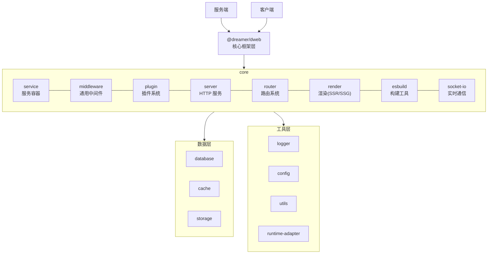

# @dreamer/dweb

> 一个兼容 Deno 和 Bun 的全栈 Web 框架，整合 @dreamer/* 库，提供开箱即用的全栈开发体验

[](https://jsr.io/@dreamer/dweb)
[](./LICENSE.md)
[](./TEST_REPORT.md)

---

## 🎯 功能

全栈 Web 框架，类似 Next.js、Remix、SvelteKit，提供完整的服务端和客户端支持。

**默认使用 Preact**：框架默认使用 Preact（轻量级、高性能），也支持
React。所有示例代码默认使用 Preact。

---

## 📦 安装

### 安装 dweb-cli 全局命令

如需在任意目录使用 `dweb-cli` 命令（如 `dweb-cli init`、`dweb-cli dev`
等），可运行 setup 脚本安装全局命令：

```bash
deno run -A jsr:@dreamer/dweb/setup
```

安装成功后，建议先执行 `dweb-cli upgrade` 升级到最新版本。

**⚠️ Beta 版本提示**：当前所有 @dreamer/* 依赖库均为 beta 版本。初始化应用时**必须**加上 `--beta` 参数，否则生成的项目依赖版本不正确，无法启动。例如：`dweb-cli init my-app --beta`。

安装完成后，可在任意目录执行：

```bash
dweb-cli init [appName] --beta   # 初始化新项目（必须加 --beta）
dweb-cli dev              # 启动开发服务器
dweb-cli build            # 构建生产版本
dweb-cli start            # 启动生产服务器
dweb-cli generate (g)     # 生成代码
dweb-cli db migrate (m)   # 数据库迁移
dweb-cli --help           # 查看完整帮助
```

**框架选择**：

- **默认使用 Preact**：框架默认使用 Preact（轻量级、高性能）
- **也支持 React**：在配置中通过 `render.engine` 指定
- **渲染模式**：`render.mode` 支持 `ssr`、`csr`、`ssg`、`hybrid`

按需安装独立库（dweb 已内置下列依赖，仅在使用其他 @dreamer/* 时需单独安装）：

```bash
# 核心库（dweb 已依赖）
deno add jsr:@dreamer/service
deno add jsr:@dreamer/middleware
deno add jsr:@dreamer/plugin
deno add jsr:@dreamer/server
deno add jsr:@dreamer/router
deno add jsr:@dreamer/render
deno add jsr:@dreamer/esbuild
deno add jsr:@dreamer/socket-io

# 数据层（可选）
deno add jsr:@dreamer/database
deno add jsr:@dreamer/cache
deno add jsr:@dreamer/storage

# 工具层（dweb 已依赖部分）
deno add jsr:@dreamer/logger
deno add jsr:@dreamer/config
deno add jsr:@dreamer/utils
deno add jsr:@dreamer/runtime-adapter
```

---

## 🌍 环境兼容性

- **运行时要求**：Deno 2.6+ 或 Bun 1.3.5
- **服务端**：✅ 支持（兼容 Deno 和 Bun 运行时，完整的服务端功能）
- **客户端**：✅ 支持（浏览器环境，SSR、CSR、SSG、Hybrid 支持）
- **依赖**：整合所有 @dreamer/* 库

---

## ✨ 特性

- ✅ **完整的全栈支持**：服务端 + 客户端一体化开发
- ✅ **文件路由系统**：基于文件系统的路由，类似 Next.js
- ✅
  **多种渲染模式**：SSR（服务端渲染）、CSR（客户端渲染）、SSG（静态站点生成）、Hybrid（混合模式）
- ✅ **默认使用 Preact**：轻量级、高性能，也支持 React
- ✅ **Socket.IO 内置**：实时双向通信，挂载到同一 HTTP 服务器，配置 `socketIo` 即可启用
- ✅ **中间件系统**：通用中间件系统，可用于 HTTP、WebSocket、消息队列等多种场景
- ✅ **插件系统**：插件生命周期管理、插件依赖、插件事件系统、热加载
- ✅ **事件系统**：App 继承 EventEmitter，支持生命周期与自定义事件（on/emit/once/off）
- ✅ **服务容器**：依赖注入和服务管理
- ✅ **数据库支持**：多种数据库适配器（PostgreSQL、MySQL、SQLite、MongoDB）
- ✅ **缓存支持**：Redis + 内存缓存 + 文件缓存
- ✅ **任务队列**：异步任务处理、定时任务、持久化队列
- ✅ **类型安全**：完整的 TypeScript 支持
- ✅ **开发体验**：HMR（热模块替换）、CLI 工具、代码提示

## 架构

### 核心框架层（dweb 直接依赖）

1. **@dreamer/service** - 服务容器（依赖注入）
   - 作用：框架核心，管理所有服务和依赖
   - 重要性：⭐⭐⭐⭐⭐

2. **@dreamer/middleware** - 通用中间件系统
   - 作用：中间件链式调用、错误处理、异步支持
   - 重要性：⭐⭐⭐⭐⭐

3. **@dreamer/plugin** - 插件管理系统
   - 作用：插件生命周期、插件依赖、插件事件
   - 依赖：@dreamer/service
   - 重要性：⭐⭐⭐⭐⭐

4. **@dreamer/server** - HTTP 服务器
   - 作用：处理 HTTP 请求与响应、集成路由与渲染
   - 依赖：@dreamer/middleware
   - 重要性：⭐⭐⭐⭐⭐

5. **@dreamer/router** - 文件路由系统
   - 作用：基于文件系统的路由扫描与匹配
   - 重要性：⭐⭐⭐⭐⭐

6. **@dreamer/render** - 渲染引擎
   - 作用：SSR / SSG 渲染（Preact、React）
   - 重要性：⭐⭐⭐⭐⭐

7. **@dreamer/esbuild** - 构建工具
   - 作用：服务端与客户端代码编译
   - 重要性：⭐⭐⭐⭐⭐

8. **@dreamer/socket-io** - 实时通信
   - 作用：WebSocket 实时双向通信（Socket.IO 协议）
   - 重要性：⭐⭐⭐⭐

### 工具层

9. **@dreamer/logger** - 日志
   - 作用：应用日志记录
   - 重要性：⭐⭐⭐⭐⭐

10. **@dreamer/config** - 配置管理
   - 作用：应用配置加载与合并
   - 重要性：⭐⭐⭐⭐

11. **@dreamer/utils** - 工具函数
    - 作用：通用工具
    - 重要性：⭐⭐⭐⭐

12. **@dreamer/console** - 控制台 / CLI
    - 作用：CLI 输出与交互（command 模块）
    - 重要性：⭐⭐⭐

13. **@dreamer/runtime-adapter** - 运行时适配
    - 作用：统一 Deno/Bun 的 fs、path、env、cwd 等 API
    - 重要性：⭐⭐⭐⭐⭐

### dweb 内部结构（源码目录）

| 目录/文件  | 说明                                                                                                                |
| ---------- | ------------------------------------------------------------------------------------------------------------------- |
| `core/`    | 核心：app、config、service、middleware、plugin、lifecycle、database、plugin-events、runtime-adapter                 |
| `feature/` | 功能：server、router、render、render-ssr、render-csr、render-ssg、render-hybrid、build、csr-client-builder、socket-io、command |
| `types/`   | 类型：AppConfig、IApp 等                                                                                            |
| `utils/`   | 工具：logger、version                                                                                               |
| `cli.ts`   | CLI 入口（createCLI）                                                                                               |
| `mod.ts`   | 主入口，统一导出                                                                                                    |

### 可选扩展（按需安装）

以下库不内置于 dweb，按需单独安装：

- **@dreamer/database** - 数据库（PostgreSQL、MySQL、SQLite、MongoDB）
- **@dreamer/cache** - 缓存（Redis、内存、文件）
- **@dreamer/storage** - 文件存储
- **@dreamer/session** - 会话
- **@dreamer/queue** - 任务队列
- **@dreamer/websocket** - 原生 WebSocket（Socket.IO 已内置于 dweb）
- **@dreamer/store** - 客户端状态
- **@dreamer/web3** - 区块链

## 架构图

下图展示 dweb 各层与核心模块的关系。



## 🎯 使用场景

（单应用、多应用、全栈、SSR/CSR/SSG/Hybrid
等，见下方「应用模式」与「快速开始」。）

## 应用模式

@dreamer/dweb 支持两种应用模式：

### 单应用模式（默认）

单一 App 实例，适合大多数场景。

### 多应用模式

支持多个应用（如
backend、frontend、mobile），每个应用独立运行，可以共享公共代码和配置。

**多应用形态约定**：

- **后台（backend/admin）**：默认为**后台管理**形态，带页面、有
  `_app.tsx`、有路由视图（如用户管理、设置页）。
- **API 应用**：若需**纯 API**（无视图、无 `_app.tsx`，仅
  `routes/api`），应单独建应用（如应用名
  `api`），与「后台」区分；模板与脚手架中可选「API 应用」形态生成仅 API
  路由的目录。

---

## 🚀 快速开始

### 1. 创建项目

使用 dweb-cli 创建项目（需先安装 dweb-cli 全局命令，见上方「安装 dweb-cli
全局命令」）：

```bash
dweb-cli init my-app --beta   # 必须加 --beta，否则依赖版本不正确无法启动 (因为当前所有依赖库都还没有发布正式版)
cd my-app
```

### 2. 项目结构

**目录结构说明**：

- **默认使用 `src/` 目录**（推荐）：框架默认使用 `src/` 目录来组织代码
- **也可以不使用 `src/` 目录**：如果不喜欢使用 `src/`
  目录，可以直接在项目根目录下创建文件
- 所有路径配置都可以自定义，根据项目结构在配置中指定正确的路径即可

#### 单应用模式（默认 basic）

**默认结构（使用 src 目录）**：

```
my-app/
├── src/
│   ├── routes/          # 文件路由
│   │   ├── _app.tsx    # 应用根组件（必须，HTML 结构写在这里）
│   │   ├── _layout.tsx # 布局组件
│   │   ├── _404.tsx    # 404 错误页面
│   │   ├── _error.tsx  # 错误页面
│   │   ├── _middleware.ts # 路由中间件
│   │   ├── index.tsx   # / 路由
│   │   ├── about.tsx   # /about 路由
│   │   └── user/
│   │       └── [id].tsx # /user/:id 路由
│   ├── main.ts         # 服务端入口
│   └── config/         # 配置文件
│       ├── main.ts     # 默认配置
│       └── main.dev.ts # 开发环境配置
└── deno.json
```

**可选结构（不使用 src 目录）**：

如果不想使用 `src/` 目录，也可以直接在项目根目录下创建文件：

```
my-app/
├── routes/             # 文件路由
│   ├── _app.tsx        # 应用根组件（必须）
│   ├── _layout.tsx     # 布局组件
│   ├── index.tsx       # / 路由
│   └── about.tsx       # /about 路由
├── main.ts             # 服务端入口
├── config/             # 配置文件
│   ├── main.ts         # 默认配置
│   └── main.dev.ts     # 开发环境配置
└── deno.json
```

**注意**：如果不使用 `src/` 目录，需要在配置中将路径改为
`"./routes"`、`"./main.ts"` 等。

#### 多应用模式 advanced

**默认结构（使用 src 目录）**：

```
my-app/
├── src/
│   ├── backend/         # 后台管理应用（默认带页面、_app.tsx、路由视图）
│   │   ├── main.ts     # 后台入口
│   │   ├── routes/     # 后台路由（页面 + 可选 api）
│   │   │   ├── _app.tsx
│   │   │   ├── index.tsx
│   │   │   └── api/    # 可选 API 路由
│   │   └── config/     # 后台配置
│   │       ├── main.ts
│   │       └── main.dev.ts
│   ├── frontend/       # 前端应用
│   │   ├── main.ts     # 前端入口
│   │   ├── routes/     # 前端路由（页面路由）
│   │   │   ├── _app.tsx
│   │   │   ├── index.tsx
│   │   │   └── about.tsx
│   │   └── config/     # 前端配置
│   │       ├── main.ts
│   │       └── main.dev.ts
│   └── common/          # 公共代码和配置
│       ├── config/     # 公共配置
│       │   ├── main.ts     # 公共默认配置
│       │   └── main.dev.ts # 公共开发环境配置
│       ├── services/   # 公共服务
│       ├── utils/      # 公共工具函数
│       └── types/      # 公共类型定义
└── deno.json
```

**可选结构（不使用 src 目录）**：

如果不想使用 `src/` 目录，也可以直接在项目根目录下创建文件：

```
my-app/
├── backend/            # 后台管理（带页面、_app.tsx）
│   ├── main.ts
│   ├── routes/
│   └── config/
├── frontend/           # 前端应用
│   ├── main.ts
│   ├── routes/
│   └── config/
├── api/                # 可选：纯 API 应用（无 _app.tsx，仅 routes/api）
│   ├── main.ts
│   ├── routes/api/
│   └── config/
├── mobile/             # 移动端应用（可选）
│   ├── main.ts
│   ├── routes/
│   └── config/
├── common/             # 公共代码和配置
│   ├── config/
│   ├── services/
│   ├── utils/
│   └── types/
└── deno.json
```

**注意**：如果不使用 `src/` 目录，需要在配置中将路径改为
`"./backend/routes"`、`"./frontend/routes"` 等。

**关于 `client/index.tsx` 的说明**：

- ✅ **可以不要**：如果使用文件路由系统，`@dreamer/router`
  会自动处理客户端代码的初始化和水合，不需要单独的 `client/index.tsx`
- ✅ **自动生成**：`@dreamer/router` 会根据 `routes/` 目录自动生成客户端入口代码
- ✅ **不影响编译和渲染**：
  - **编译**：`@dreamer/esbuild` 会从 `routes/`
    目录自动分析入口点，不需要手动指定 `client/index.tsx`
  - **客户端渲染（CSR）**：`@dreamer/router` 会自动生成客户端路由代码，包括
    React/Preact 应用的初始化和路由导航
  - **服务端渲染（SSR）**：`@dreamer/router` 会自动处理 SSR 渲染和客户端水合
  - **静态站点生成（SSG）**：`@dreamer/router` 会在构建时预渲染所有路由为静态
    HTML
  - **混合模式（Hybrid）**：`@dreamer/router` 支持 SSR 首屏渲染，后续路由使用
    CSR
- ✅ **可以在 `_app.tsx` 中处理**：所有自定义客户端初始化逻辑都可以在 `_app.tsx`
  中处理，不需要单独的 `client/index.tsx`

**特殊文件的处理**：

所有特殊文件（`_app.tsx`、`_layout.tsx`、`_404.tsx`、`_error.tsx`、`_middleware.ts`）都在
**`@dreamer/router`** 中处理：

- **`@dreamer/router` 负责**：
  - 扫描和识别特殊文件（以 `_` 开头的文件）
  - 处理 `_app.tsx`：作为应用根组件，生成 HTML 结构
  - 处理 `_layout.tsx`：作为布局组件，包裹所有路由页面
  - 处理 `_404.tsx`：路由不匹配时使用
  - 处理 `_error.tsx`：发生错误时使用
  - 处理 `_middleware.ts`：路由级别的中间件，在路由匹配前执行
  - 自动生成客户端入口代码（基于 `_app.tsx` 和路由文件）
  - 处理 SSR 渲染和客户端水合

- **工作流程**：
  1. `@dreamer/router` 扫描 `routes/` 目录
  2. 识别特殊文件和普通路由文件
  3. 根据 `_app.tsx` 生成 HTML 结构
  4. 根据路由文件生成路由配置
  5. 自动生成客户端入口代码（包含 React/Preact 初始化、路由导航、水合逻辑）
  6. `@dreamer/esbuild` 使用自动生成的入口代码进行编译

### 3. 创建应用

#### 单应用模式

```typescript
// src/main.ts
import { App } from "jsr:@dreamer/dweb";

// 创建单一 App 实例（默认模式）
const app = new App({
  name: "my-app",
  version: "1.0.0",

  // 服务器配置
  server: {
    port: 3000,
    host: "localhost",
  },

  // 渲染配置（engine: preact | react；mode: ssr | csr | ssg | hybrid）
  render: {
    engine: "preact",
    mode: "ssr",
  },

  // 路由配置（基于文件系统）
  router: {
    routesDir: "./src/routes",
  },

  // 日志配置
  logger: {
    level: "info",
  },

  // 构建配置
  build: {
    server: {
      entry: "src/main.ts",
      output: "dist",
    },
  },
});

// 全局中间件
app.use(async (_req, _res, next) => {
  console.log(`${_req.method} ${_req.url}`);
  await next();
});

// 启动应用
await app.start();
```

**单应用模式特点**：

- ✅ 单一 App 实例
- ✅ 所有功能在一个应用中
- ✅ 适合大多数场景
- ✅ 简单直接

**单应用模式配置**：

```typescript
// deno.json
{
  "tasks": {
    // 开发环境启动（默认使用 src 目录）
    "dev": "deno run --allow-all src/main.ts",
    // 如果不使用 src 目录，改为： "deno run --allow-all main.ts"

    // 构建
    "build": "deno task build",

    // 生产环境启动（启动构建后的版本）
    "start": "deno run --allow-all dist/main.js",

    // 其他工具
    "test": "deno test",
    "fmt": "deno fmt",
    "lint": "deno lint"
  }
}
```

**路径配置说明**：

- **默认使用 `src/` 目录**：框架默认路径为 `./src/main.ts`、`./src/routes` 等
- **也可以不使用 `src/` 目录**：如果不使用 `src/` 目录，需要将路径改为
  `./main.ts`、`./routes` 等
- 根据项目结构在配置中指定正确的路径即可

**启动方式**：

- **开发环境**：`deno task dev` - 启动开发服务器
- **生产环境**：
  1. 先构建：`deno task build` - 构建生产版本
  2. 启动：`deno task start` - 启动构建后的版本

#### 多应用模式

```typescript
// src/backend/main.ts（后台管理：带 _app.tsx、页面路由）
import { App } from "jsr:@dreamer/dweb";
import { loadCommonConfig } from "../common/config/main.ts";

const backendApp = new App({
  name: "backend",
  ...loadCommonConfig(),
  server: { port: 3000, host: "localhost" },
  router: { routesDir: "./src/backend/routes" },
  render: { engine: "preact", mode: "ssr" },
});

backendApp.use("/api", async (_req, _res, next) => await next());
await backendApp.start();
```

```typescript
// src/frontend/main.ts
import { App } from "jsr:@dreamer/dweb";
import { loadCommonConfig } from "../common/config/main.ts";

const frontendApp = new App({
  name: "frontend",
  ...loadCommonConfig(),
  server: { port: 3001, host: "localhost" },
  router: { routesDir: "./src/frontend/routes" },
  render: { engine: "preact", mode: "hybrid" },
});

await frontendApp.start();
```

```typescript
// src/mobile/main.ts
import { App } from "jsr:@dreamer/dweb";
import { loadCommonConfig } from "../common/config/main.ts";

const mobileApp = new App({
  name: "mobile",
  ...loadCommonConfig(),
  server: { port: 3002, host: "localhost" },
  router: { routesDir: "./src/mobile/routes" },
  render: { engine: "preact", mode: "csr" },
});

await mobileApp.start();
```

**多应用模式特点**：

- ✅ 多个独立 App 实例
- ✅ 每个应用有自己的 main.ts 和 config
- ✅ 可以共享公共代码和配置（common 目录）
- ✅ 适合大型项目，前后端分离
- ✅ 后台（backend/admin）默认带页面、_app.tsx；纯 API 无视图时单独建应用（如
  `api`，仅 routes/api）

#### 公共配置和代码

```typescript
// src/common/config/main.ts（默认使用 src 目录）
// 公共配置，所有应用共享
export function loadCommonConfig() {
  return {
    database: {
      adapter: "postgresql",
      connection: {
        host: Deno.env.get("DB_HOST") || "localhost",
        port: parseInt(Deno.env.get("DB_PORT") || "5432"),
        database: Deno.env.get("DB_NAME") || "mydb",
        user: Deno.env.get("DB_USER") || "user",
        password: Deno.env.get("DB_PASSWORD") || "password",
      },
    },
    cache: {
      adapter: "redis",
      connection: {
        host: Deno.env.get("REDIS_HOST") || "localhost",
        port: parseInt(Deno.env.get("REDIS_PORT") || "6379"),
      },
    },
    // 其他公共配置...
  };
}
```

```typescript
// src/common/config/main.dev.ts（默认使用 src 目录）
// 公共开发环境配置
import { loadCommonConfig } from "./main.ts";

export function loadCommonDevConfig() {
  return {
    ...loadCommonConfig(),
    // 开发环境特定配置
    debug: true,
    logLevel: "debug",
  };
}
```

#### 共享 App 实例

在某些场景下，可能需要多个应用或工具（如 console CLI）共享同一个 App 实例：

```typescript
// src/common/app.ts
// 创建共享的 App 实例
import type { AppConfig } from "jsr:@dreamer/dweb";
import { App } from "jsr:@dreamer/dweb";
import { loadCommonConfig } from "./config/main.ts";

let sharedApp: App | null = null;

export function getSharedApp(): App {
  if (!sharedApp) {
    sharedApp = new App(loadCommonConfig() as AppConfig);
  }
  return sharedApp;
}

export function createApp(config?: Partial<AppConfig>): App {
  return new App({ ...loadCommonConfig(), ...config } as AppConfig);
}
```

**使用共享实例**：

```typescript
// src/backend/main.ts（默认使用 src 目录）
import { getSharedApp } from "../common/app.ts";

const app = getSharedApp();
// 配置后端特定设置
app.config.port = 3000;
await app.start();
```

```typescript
// console CLI 工具中使用
import { getSharedApp } from "../common/app.ts";

const app = getSharedApp();
const db = app.container.get("database");
// 使用数据库服务执行 CLI 命令
```

**多应用模式配置和启动**：

```typescript
// deno.json
{
  "tasks": {
    // 开发环境启动（默认使用 src 目录）
    "dev:backend": "deno run --allow-all src/backend/main.ts",
    "dev:frontend": "deno run --allow-all src/frontend/main.ts",
    "dev:mobile": "deno run --allow-all src/mobile/main.ts",
    // 如果不使用 src 目录，改为：
    // "dev:backend": "deno run --allow-all backend/main.ts",
    // "dev:frontend": "deno run --allow-all frontend/main.ts",
    // "dev:mobile": "deno run --allow-all mobile/main.ts",

    // 构建
    "build:backend": "deno task build --app=backend",
    "build:frontend": "deno task build --app=frontend",
    "build:mobile": "deno task build --app=mobile",

    // 生产环境启动（启动构建后的版本）
    "start:backend": "deno run --allow-all dist/backend/main.js",
    "start:frontend": "deno run --allow-all dist/frontend/main.js",
    "start:mobile": "deno run --allow-all dist/mobile/main.js"
  }
}
```

**路径配置说明**：

- **默认使用 `src/` 目录**：框架默认路径为
  `src/backend/main.ts`、`src/frontend/main.ts` 等
- **也可以不使用 `src/` 目录**：如果不使用 `src/` 目录，需要将路径改为
  `backend/main.ts`、`frontend/main.ts` 等
- 根据项目结构在配置中指定正确的路径即可

**启动方式**：

**开发环境**：

- 手动分开启动：使用
  `deno task dev:backend`、`deno task dev:frontend`、`deno task dev:mobile`
  分别启动各个应用
- 每个应用独立运行在不同的端口
- 可以根据需要选择性启动部分应用

**生产环境**：

1. 先构建：`deno task build:backend`、`deno task build:frontend`、`deno task build:mobile`
2. 启动构建后的版本：`deno task start:backend`、`deno task start:frontend`、`deno task start:mobile`
3. 每个应用独立运行在不同的端口
4. 可以根据需要选择性启动部分应用

### 4. 创建路由和特殊文件

#### 应用根组件（必须）

```typescript
// src/routes/_app.tsx（默认使用 src 目录）
// 这是应用的根组件，HTML 结构写在这里
// 所有客户端初始化逻辑都可以在这里处理

import { useEffect } from "preact/hooks";
// 使用 @dreamer/store 进行状态管理（推荐）
import { createStore } from "jsr:@dreamer/store";
// 或使用 Signals 方式
// import { signal } from "jsr:@dreamer/store";
import { Analytics } from "./analytics"; // 第三方库

// 使用 @dreamer/store 创建全局状态（推荐）
interface UserStore {
  user: { name: string; isAuthenticated: boolean } | null;
  setUser: (user: UserStore["user"]) => void;
}

const useUserStore = createStore<UserStore>((set) => ({
  user: null,
  setUser: (user) => set({ user }),
}));

export default function App(
  { children }: { children: preact.ComponentChildren },
) {
  // 客户端初始化逻辑（只在客户端执行）
  useEffect(() => {
    // 1. 全局状态管理初始化
    // @dreamer/store 不需要 Provider，可以直接使用

    // 2. 第三方库初始化
    Analytics.init({
      apiKey: "your-api-key",
    });

    // 3. 全局事件监听
    window.addEventListener("resize", handleResize);

    // 4. 性能监控
    if (typeof window !== "undefined") {
      // 客户端特定的初始化逻辑
      console.log("客户端应用已初始化");
    }

    // 清理函数
    return () => {
      window.removeEventListener("resize", handleResize);
    };
  }, []);

  return (
    <html lang="zh-CN">
      <head>
        <meta charSet="UTF-8" />
        <meta name="viewport" content="width=device-width, initial-scale=1.0" />
        <title>My App</title>
      </head>
      <body>
        {/* 全局状态管理（使用 Preact 兼容的状态管理库） */}
        <div id="root">
          {children}
        </div>
      </body>
    </html>
  );
}
```

**自定义客户端初始化逻辑说明**：

以下场景都可以在 `_app.tsx` 中处理，**不需要** `client/index.tsx`：

1. **全局状态管理**：
   - 推荐使用 `@dreamer/store`（框架官方状态管理库）
   - 支持 Store 方式（类似 Zustand）和 Signals 方式（类似 Preact Signals）
   - 在 `_app.tsx` 中初始化状态管理
   - 也可以使用其他 Preact 兼容的状态管理库（如 `@preact/signals`、`zustand`
     等）

2. **第三方库初始化**：
   - Analytics（Google Analytics、Mixpanel 等）
   - 监控工具（Sentry、LogRocket 等）
   - UI 库（Material-UI、Ant Design 等）
   - 在 `_app.tsx` 的 `useEffect` 中初始化

3. **全局配置**：
   - 主题配置
   - 国际化配置
   - 全局样式
   - 在 `_app.tsx` 中配置

4. **客户端特定逻辑**：
   - 浏览器 API 使用（localStorage、sessionStorage）
   - 事件监听（resize、scroll 等）
   - 性能监控
   - 在 `_app.tsx` 的 `useEffect` 中处理

**为什么不需要 `client/index.tsx`**：

- ✅ **`_app.tsx` 足够**：`_app.tsx`
  是应用的根组件，所有客户端初始化逻辑都可以在这里处理
- ✅ **自动执行**：`@dreamer/router` 会自动处理 `_app.tsx` 的客户端初始化和水合
- ✅ **SSR 兼容**：`useEffect` 只在客户端执行，不会影响 SSR
- ✅ **更符合约定**：类似 Next.js 的 `_app.tsx`，开发者更熟悉

**只有在以下极端情况下才需要 `client/index.tsx`**：

- 需要完全自定义客户端入口代码的生成逻辑
- 需要绕过框架的自动代码生成
- 需要特殊的构建配置

对于 99% 的使用场景，在 `_app.tsx` 中处理就足够了。

#### 布局组件

```typescript
// src/routes/_layout.tsx（默认使用 src 目录）
// 全局布局组件，所有路由都会使用这个布局
export default function Layout(
  { children }: { children: preact.ComponentChildren },
) {
  return (
    <div>
      <header>
        <nav>
          <a href="/">首页</a>
          <a href="/about">关于</a>
        </nav>
      </header>
      <main>{children}</main>
      <footer>© 2024 My App</footer>
    </div>
  );
}
```

#### 404 错误页面

```typescript
// src/routes/_404.tsx（默认使用 src 目录）
// 当路由不匹配时显示此页面
export default function NotFound() {
  return (
    <div>
      <h1>404 - 页面未找到</h1>
      <p>抱歉，您访问的页面不存在。</p>
      <a href="/">返回首页</a>
    </div>
  );
}
```

#### 错误页面

```typescript
// src/routes/_error.tsx（默认使用 src 目录）
// 当发生错误时显示此页面
export default function Error({ error }: { error?: Error }) {
  return (
    <div>
      <h1>出错了</h1>
      <p>{error?.message || "发生了未知错误"}</p>
      <a href="/">返回首页</a>
    </div>
  );
}
```

#### 路由中间件

```typescript
// src/routes/_middleware.ts（默认使用 src 目录）
// 路由级别的中间件，在路由匹配前执行
export default function middleware(req: Request) {
  // 可以在这里进行认证、重定向等操作
  const token = req.headers.get("authorization");

  if (!token && req.url.includes("/admin")) {
    return new Response(null, {
      status: 302,
      headers: { Location: "/login" },
    });
  }

  // 返回 null 表示继续处理
  return null;
}
```

#### 普通路由

```typescript
// src/routes/index.tsx（默认使用 src 目录）
export default function Home() {
  return (
    <div>
      <h1>欢迎使用 Dreamer Framework</h1>
    </div>
  );
}
```

```typescript
// src/routes/user/[id].tsx（默认使用 src 目录）
export default function User({ params }: { params: { id: string } }) {
  return (
    <div>
      <h1>用户 ID: {params.id}</h1>
    </div>
  );
}
```

### 特殊文件说明

| 文件名           | 说明       | 是否必须    | 作用                                         |
| ---------------- | ---------- | ----------- | -------------------------------------------- |
| `_app.tsx`       | 应用根组件 | ✅ **必须** | 定义 HTML 结构，所有页面都会包裹在这个组件中 |
| `_layout.tsx`    | 布局组件   | ❌ 可选     | 全局布局，所有路由都会使用这个布局           |
| `_404.tsx`       | 404 页面   | ❌ 可选     | 路由不匹配时显示的页面                       |
| `_error.tsx`     | 错误页面   | ❌ 可选     | 发生错误时显示的页面                         |
| `_middleware.ts` | 路由中间件 | ❌ 可选     | 路由级别的中间件，在路由匹配前执行           |

**文件处理规则**：

- 以 `_` 开头的文件是特殊文件，不会生成路由
- `_app.tsx` 是必须的，用于定义应用的 HTML 结构
- 其他特殊文件都是可选的，根据需要添加

**处理机制**：

所有特殊文件都在 **`@dreamer/router`** 中处理：

1. **扫描阶段**：`@dreamer/router` 扫描 `routes/` 目录时，会识别以 `_`
   开头的特殊文件
2. **特殊文件处理**：
   - `_app.tsx`：作为应用根组件，用于生成 HTML 结构和客户端入口代码
   - `_layout.tsx`：作为布局组件，自动包裹所有路由页面
   - `_404.tsx`：路由不匹配时自动使用
   - `_error.tsx`：发生错误时自动使用
   - `_middleware.ts`：在路由匹配前执行
3. **客户端代码生成**：
   - `@dreamer/router` 根据 `_app.tsx` 和路由文件自动生成客户端入口代码
   - 生成的代码包含：React/Preact 初始化、路由导航、SSR 水合逻辑
   - 不需要手动创建 `client/index.tsx`
4. **编译处理**：
   - `@dreamer/esbuild` 使用 `@dreamer/router` 自动生成的客户端入口代码进行编译
   - 不影响编译和客户端渲染功能

**去掉 `client/index.tsx` 的影响分析**：

- ✅ **不影响编译**：`@dreamer/router`
  会自动生成客户端入口代码，`@dreamer/esbuild` 会使用这个自动生成的入口进行编译
- ✅ **不影响客户端渲染（CSR）**：自动生成的客户端代码包含完整的 React/Preact
  应用初始化、路由导航、状态管理等功能
- ✅ **不影响服务端渲染（SSR）**：自动生成的代码包含 SSR 渲染和客户端水合逻辑
- ✅ **支持静态站点生成（SSG）**：构建时预渲染所有路由为静态 HTML
- ✅ **支持混合模式（Hybrid）**：SSR 首屏渲染，后续路由使用 CSR
- ✅ **更简洁**：开发者只需要关注 `routes/`
  目录中的路由文件，不需要手动管理客户端入口代码

---

## 🎨 使用示例

### 事件系统

App 继承 **EventEmitter**，可在应用生命周期关键节点监听或触发事件，也可用于自定义业务事件。

| 方法                           | 说明                 |
| ------------------------------ | -------------------- |
| `app.on(eventName, handler)`   | 监听事件，可多次注册 |
| `app.once(eventName, handler)` | 仅触发一次后自动移除 |
| `app.emit(eventName, ...args)` | 触发事件，可传参     |
| `app.off(eventName, handler)`  | 移除指定监听器       |

**内置事件**（由框架在对应时机自动触发）：

| 事件名  | 触发时机                                                           | 说明       |
| ------- | ------------------------------------------------------------------ | ---------- |
| `init`  | 应用初始化完成（配置、服务、路由等就绪）                           | 仅一次     |
| `start` | 应用启动（`await app.start()` 内，生命周期 start 前）              | 每次 start |
| `stop`  | 应用停止（`await app.stop()` 内）                                  | 每次 stop  |
| `build` | 构建完成（`await app.build()` 成功结束后）                         | 仅构建模式 |
| `error` | 未捕获错误时（EventEmitter 约定，可主动 `app.emit("error", err)`） | 可选       |

**自定义事件**：除内置事件外，可任意命名并 `emit`。

```typescript
import { App } from "jsr:@dreamer/dweb";

const app = new App({ name: "my-app", version: "1.0.0" /* ... */ });

// 监听应用初始化完成
app.on("init", () => {
  console.log("应用已初始化，可安全访问 container、config 等");
});

// 监听应用启动
app.on("start", () => {
  console.log("应用已启动，服务器开始监听");
});

// 监听构建完成
app.on("build", () => {
  console.log("构建完成，可执行部署脚本等");
});

// 一次性监听
app.once("init", () => {
  console.log("仅首次 init 时执行");
});

// 自定义事件：业务侧触发与监听
app.on("user:login", (userId: string) => {
  console.log("用户登录:", userId);
});
// 某处触发：app.emit("user:login", "123");
```

**与插件钩子的区别**：插件的 `onInit`、`onStart`、`onStop` 等由
**插件事件系统**（`@dreamer/dweb/core/plugin-events`）在已激活插件上调用，用于插件自身逻辑；App
的 `init`、`start`、`stop` 等 **EventEmitter
事件**面向应用层，用于日志、监控或与业务代码解耦。

---

### 中间件系统

```typescript
import { App } from "jsr:@dreamer/dweb";

const app = new App({ ... });

// 全局中间件
app.use(async (req, res, next) => {
  // 请求日志
  console.log(`${req.method} ${req.url}`);
  await next();
});

// 路径匹配中间件
app.use("/api", async (req, res, next) => {
  // 只对 /api 路径生效
  await next();
});

// 错误处理中间件
app.useError(async (req, res, error, next) => {
  console.error("Error:", error);
  res.status(500).json({ error: "Internal Server Error" });
});
```

### 插件系统

```typescript
import { PluginManager } from "jsr:@dreamer/plugin";

const pluginManager = new PluginManager(app.container);

// 注册插件
await pluginManager.register({
  name: "auth-plugin",
  version: "1.0.0",
  dependencies: ["database-plugin"],
  async install(container) {
    // 插件通过 container 注册服务
    container.registerSingleton("authService", () => new AuthService());
  },
  async activate(container) {
    const authService = container.get("authService");
    await authService.initialize();
  },
});

// 安装并激活插件
await pluginManager.install("auth-plugin");
await pluginManager.activate("auth-plugin");
```

### 数据库操作

```typescript
// 从服务容器获取数据库服务
const db = app.container.get("database");

// 查询数据
const users = await db.table("users")
  .select("id", "name", "email")
  .where("age", ">", 18)
  .orderBy("created_at", "desc")
  .limit(10)
  .execute();

// 插入数据
await db.table("users").insert({
  name: "Alice",
  email: "alice@example.com",
  age: 30,
});

// 事务
await db.transaction(async (trx) => {
  await trx.table("users").insert({ name: "Bob" });
  await trx.table("orders").insert({ user_id: 1, amount: 100 });
});
```

### 缓存使用

```typescript
// 从服务容器获取缓存服务
const cache = app.container.get("cache");

// 设置缓存
await cache.set("user:123", { name: "Alice", age: 30 }, 3600);

// 获取缓存
const user = await cache.get("user:123");

// 删除缓存
await cache.delete("user:123");
```

### 配置管理

```typescript
// 从服务容器获取配置服务
const config = app.container.get("config");

// 获取配置
const dbHost = config.get("database.host");
const apiKey = config.get("api.key");
```

### 数据验证

```typescript
import { validate } from "jsr:@dreamer/validator";

// 验证请求数据
const schema = {
  name: { type: "string", required: true, minLength: 2 },
  email: { type: "email", required: true },
  age: { type: "number", min: 18, max: 100 },
};

const result = await validate(req.body, schema);
if (!result.valid) {
  return res.status(400).json({ errors: result.errors });
}
```

### 日志记录

```typescript
// 从服务容器获取日志服务
const logger = app.container.get("logger");

logger.info("应用启动");
logger.warn("警告信息");
logger.error("错误信息");
```

### 任务队列

```typescript
// 从服务容器获取队列服务
const queue = app.container.get("queue");

// 添加任务
await queue.add("send-email", {
  to: "user@example.com",
  subject: "Welcome",
  body: "Welcome to our service!",
});

// 处理任务
queue.process("send-email", async (job) => {
  await sendEmail(job.data);
});
```

## 渲染模式

通过 `render.mode` 配置，支持四种模式：`ssr`、`csr`、`ssg`、`hybrid`。

### 服务端渲染（SSR）

```typescript
const app = new App({
  render: { engine: "preact", mode: "ssr" },
  router: { routesDir: "./src/routes" },
  // ...
});
```

### 客户端渲染（CSR）

```typescript
const app = new App({
  render: { engine: "preact", mode: "csr" },
  router: { routesDir: "./src/routes" },
  // ...
});
```

### 混合模式（Hybrid）

```typescript
// 首屏 SSR，后续路由 CSR + 客户端水合
const app = new App({
  render: { engine: "preact", mode: "hybrid" },
  router: { routesDir: "./src/routes" },
  // ...
});
```

### 静态站点生成（SSG）

```typescript
// 从预渲染输出目录提供静态 HTML；构建阶段需单独调用 @dreamer/render 的 renderSSG 生成到 config.render.ssg.outputDir（默认 dist/static）
const app = new App({
  render: {
    engine: "preact",
    mode: "ssg",
    ssg: { outputDir: "dist/static" },
  },
  router: { routesDir: "./src/routes" },
  // ...
});
```

**SSG 使用场景**：

- 博客、文档站点
- 营销页面
- 产品展示页面
- 任何不需要动态数据的页面

**SSG 优势**：

- ✅ 极快的加载速度（CDN 缓存）
- ✅ 更好的 SEO（完全静态 HTML）
- ✅ 更低的服务器成本（无需运行时）
- ✅ 更高的安全性（无服务器端代码执行）

## 开发工具

### CLI 工具

CLI 可通过项目内 `deno task` 使用，或安装为全局命令 `dweb-cli`（运行
`deno run -A jsr:@dreamer/dweb/setup`）。

**单应用模式**：

```bash
# 启动开发服务器
deno task dev

# 构建生产版本
deno task build

# 启动生产服务器（构建后的版本）
deno task start

# 运行测试
deno task test

# 代码格式化
deno task fmt

# 代码检查
deno task lint
```

**多应用模式**：

```bash
# 开发环境启动
deno task dev:backend    # 启动后端开发服务器
deno task dev:frontend   # 启动前端开发服务器
deno task dev:mobile     # 启动移动端开发服务器

# 构建
deno task build:backend  # 构建后端
deno task build:frontend # 构建前端
deno task build:mobile   # 构建移动端

# 生产环境启动（构建后的版本）
deno task start:backend  # 启动后端生产服务器
deno task start:frontend # 启动前端生产服务器
deno task start:mobile   # 启动移动端生产服务器

# 其他工具
deno task test           # 运行测试
deno task fmt            # 代码格式化
deno task lint           # 代码检查
```

### HMR（热模块替换）

开发模式下自动支持 HMR（Hot Module
Replacement），修改代码后自动刷新，无需手动刷新浏览器。

## 与其他框架对比

| 特性       | @dreamer/dweb | Next.js | Remix   | SvelteKit |
| ---------- | ------------- | ------- | ------- | --------- |
| 运行时     | Deno / Bun    | Node.js | Node.js | Node.js   |
| 文件路由   | ✅            | ✅      | ✅      | ✅        |
| SSR        | ✅            | ✅      | ✅      | ✅        |
| CSR        | ✅            | ✅      | ✅      | ✅        |
| SSG        | ✅            | ✅      | ✅      | ✅        |
| Hybrid     | ✅            | ✅      | ✅      | ✅        |
| 中间件     | ✅            | ✅      | ✅      | ✅        |
| 插件系统   | ✅            | ❌      | ❌      | ❌        |
| 服务容器   | ✅            | ❌      | ❌      | ❌        |
| 数据库     | ✅            | ❌      | ❌      | ❌        |
| TypeScript | ✅            | ✅      | ✅      | ✅        |

## 应用模式对比

| 特性         | 单应用模式                                         | 多应用模式                                                                 |
| ------------ | -------------------------------------------------- | -------------------------------------------------------------------------- |
| **App 实例** | 单一实例                                           | 多个独立实例                                                               |
| **项目结构** | 简单（routes、main.ts 或 src/routes、src/main.ts） | 复杂（backend、frontend、mobile 或 src/backend、src/frontend、src/mobile） |
| **配置管理** | 单一配置目录                                       | 每个应用独立配置 + 公共配置（common/config）                               |
| **适用场景** | 中小型项目、全栈应用                               | 大型项目、前后端分离、多端应用                                             |
| **代码共享** | 直接共享                                           | 通过 common 目录共享                                                       |
| **启动方式** | 单一入口                                           | 多个入口（可并行启动）                                                     |
| **复杂度**   | 低                                                 | 中高                                                                       |
| **共享实例** | 直接使用                                           | 通过 getSharedApp() 获取共享实例                                           |

**选择建议**：

- **单应用模式**：适合大多数场景，简单直接，推荐默认使用
- **多应用模式**：适合大型项目、需要前后端分离、多端应用（Web、Mobile）的场景

---

## 📚 配置文档

- **[AppConfig 完整配置示例](./APP_CONFIG_EXAMPLE.md)**：涵盖 server、router、render、build、logger、database、socketIo、plugins、middlewares 等全部配置项及单应用/多应用示例。

---

## 📦 扩展库

以下为 dreamer-jsr 生态中**按需选用**的扩展库，用于在 dweb
项目里增加认证、缓存、支付、实时通信等能力。dweb
已内置运行所需的核心依赖，无需单独安装；仅当需要下表能力时再安装对应库。

| 库名                         | 简介                                                 | GitHub                                                           |
| ---------------------------- | ---------------------------------------------------- | ---------------------------------------------------------------- |
| **@dreamer/auth**            | 用户认证：JWT、OAuth2、Session、刷新 Token、权限校验 | [auth](https://github.com/shuliangfu/auth)                       |
| **@dreamer/cache**           | 缓存：内存 / 文件 / Redis / Memcached，统一接口      | [cache](https://github.com/shuliangfu/cache)                     |
| **@dreamer/console**         | 控制台与 CLI：命令封装、美化输出、表格、交互         | [console](https://github.com/shuliangfu/console)                 |
| **@dreamer/crypto**          | 加密与安全：哈希、加解密、签名、JWT 等               | [crypto](https://github.com/shuliangfu/crypto)                   |
| **@dreamer/database**        | 数据库：多库适配、ORM/ODM、查询构建、迁移            | [database](https://github.com/shuliangfu/database)               |
| **@dreamer/email**           | 邮件发送：SMTP 客户端、HTML 邮件                     | [email](https://github.com/shuliangfu/email)                     |
| **@dreamer/foundry**         | 智能合约：Foundry 部署与验证（EVM 链）               | [foundry](https://github.com/shuliangfu/foundry)                 |
| **@dreamer/humancheck**      | 人机验证：图形/数学/滑块验证码、TOTP、第三方         | [humancheck](https://github.com/shuliangfu/humancheck)           |
| **@dreamer/i18n**            | 国际化：翻译、格式化、多语言管理                     | [i18n](https://github.com/shuliangfu/i18n)                       |
| **@dreamer/image**           | 图片处理：缩放、转换、压缩（服务端/客户端）          | [image](https://github.com/shuliangfu/image)                     |
| **@dreamer/logger**          | 日志：多级别、格式化、轮转（服务端/客户端）          | [logger](https://github.com/shuliangfu/logger)                   |
| **@dreamer/markdown**        | Markdown：解析、GFM、目录、多种扩展语法              | [markdown](https://github.com/shuliangfu/markdown)               |
| **@dreamer/middlewares**     | HTTP 中间件集：Request ID、日志、CORS 等             | [middlewares](https://github.com/shuliangfu/middlewares)         |
| **@dreamer/notification**    | 通知：Web Push、邮件、短信、Webhook、模板与队列      | [notification](https://github.com/shuliangfu/notification)       |
| **@dreamer/payment**         | 统一支付：Stripe、PayPal、支付宝、微信、Web3 等      | [payment](https://github.com/shuliangfu/payment)                 |
| **@dreamer/plugins**         | 官方插件集：CSS 原子化、i18n、SEO、PWA、认证等       | [plugins](https://github.com/shuliangfu/plugins)                 |
| **@dreamer/queue**           | 任务队列：多适配器、调度、并发控制                   | [queue](https://github.com/shuliangfu/queue)                     |
| **@dreamer/runtime-adapter** | 运行时适配：Deno/Bun 统一的 fs、path、env 等         | [runtime-adapter](https://github.com/shuliangfu/runtime-adapter) |
| **@dreamer/session**         | 会话：持久化 Session，Redis/MongoDB/文件后端         | [session](https://github.com/shuliangfu/session)                 |
| **@dreamer/service**         | 服务容器：依赖注入、单例/多例/工厂                   | [service](https://github.com/shuliangfu/service)                 |
| **@dreamer/socket-io**       | Socket.IO：实时双向通信，多运行时（dweb 已内置）   | [socket-io](https://github.com/shuliangfu/socket-io)             |
| **@dreamer/storage**         | 存储：文件存储抽象与多后端                           | [storage](https://github.com/shuliangfu/storage)                 |
| **@dreamer/store**           | 客户端状态：Preact/React 响应式状态管理              | [store](https://github.com/shuliangfu/store)                     |
| **@dreamer/stream**          | 直播流：推流、拉流、转码与协议适配                   | [stream](https://github.com/shuliangfu/stream)                   |
| **@dreamer/test**            | 测试：Mock、断言、浏览器测试等                       | [test](https://github.com/shuliangfu/test)                       |
| **@dreamer/theme**           | 主题：明暗模式、持久化偏好                           | [theme](https://github.com/shuliangfu/theme)                     |
| **@dreamer/upload**          | 文件上传：分片、断点续传、云存储适配                 | [upload](https://github.com/shuliangfu/upload)                   |
| **@dreamer/utils**           | 工具函数：通用工具与校验等                           | [utils](https://github.com/shuliangfu/utils)                     |
| **@dreamer/video**           | 视频处理：转码、压缩等（服务端/客户端）              | [video](https://github.com/shuliangfu/video)                     |
| **@dreamer/video-player**    | 视频播放器：多格式、多协议、多引擎                   | [video-player](https://github.com/shuliangfu/video-player)       |
| **@dreamer/web3**            | Web3：RPC、合约交互（服务端/客户端）                 | [web3](https://github.com/shuliangfu/web3)                       |
| **@dreamer/webrtc**          | WebRTC：实时音视频与信令                             | [webrtc](https://github.com/shuliangfu/webrtc)                   |
| **@dreamer/websocket**       | 原生 WebSocket：服务端与客户端实时通信（Socket.IO 已内置） | [websocket](https://github.com/shuliangfu/websocket)             |

安装示例：`deno add jsr:@dreamer/库名` 或
`bunx jsr add @dreamer/库名`。各库详细用法见 JSR 对应包页面或仓库 README。

---

## 📊 测试报告

单元测试结果与覆盖说明见 [TEST_REPORT.md](./TEST_REPORT.md)。当前 23
个测试文件、287 个用例全部通过。

---

## 📝 注意事项

- **包名**：@dreamer/dweb 为框架主包，整合
  @dreamer/server、@dreamer/router、@dreamer/render、@dreamer/esbuild 等
- **入口类**：使用 `App`
  类创建应用（`import { App } from "jsr:@dreamer/dweb"`），配置为
  `AppConfig`（name、server、render、router、build、logger 等）
- **按需使用**：可仅使用 dweb，或按需安装其他 @dreamer/*
  库（database、cache、storage 等）
- **类型安全**：完整 TypeScript 类型支持
- **应用模式**：支持单应用与多应用模式；可共享 App 实例（如
  getSharedApp）供多入口或 CLI 使用

---

## 🤝 贡献

欢迎提交 Issue 和 Pull Request！

**开发 dweb 库时**（在 dweb 目录下）：

- 类型检查：`deno task check` 或 `deno check src/ tests/`（仅检查核心代码，不包含 examples）
- 测试：`deno test -A tests/unit` 或 `bun test`

---

## 📄 许可证

MIT License - 详见 [LICENSE.md](./LICENSE.md)

---

<div align="center">

**Made with ❤️ by Dreamer Team**

</div>
