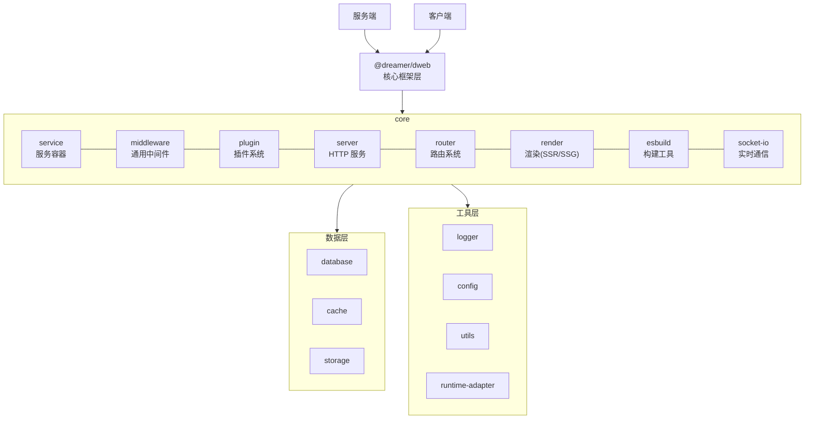
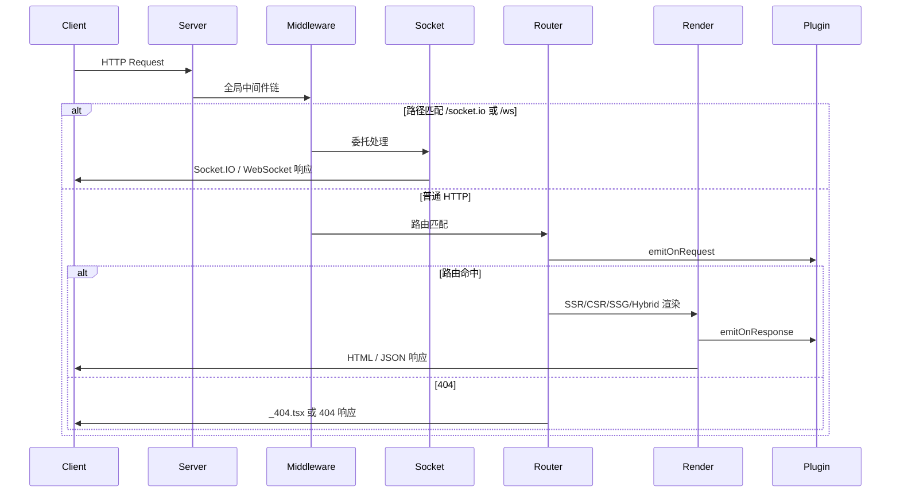

# @dreamer/dweb

> 📖 [English](../../README.md) | 中文

> 一个兼容 Deno 和 Bun 的全栈 Web 框架，整合 @dreamer/*
> 包，提供开箱即用的全栈开发体验

[](https://jsr.io/@dreamer/dweb)
[](../../LICENSE)
[](./TEST_REPORT.md)

---

## 🎯 功能

全栈 Web 框架，类似 Next.js、Remix、SvelteKit，提供完整的服务端和客户端支持。

**三种模板引擎**：

- **View**（推荐）：Dweb 自有视图层（`@dreamer/view`），轻量、无虚拟 DOM、基于
  signal 的细粒度更新，完整支持 SSR/SSG/CSR/hybrid。 详情查看
  https://github.com/shuliangfu/view
- **Preact**：轻量且兼容 React，示例中常用。
- **React**：通过 `render.engine: "react"` 完整支持。

---

## 📦 安装

### 安装 dweb-cli 全局命令

如需在任意目录使用 `dweb-cli` 命令（如 `dweb-cli init`、`dweb-cli dev`
等），可运行 setup 脚本安装全局命令：

```bash
deno run -A jsr:@dreamer/dweb/setup
```

安装成功后，建议先执行 `dweb-cli upgrade` 升级到最新版本。

安装完成后，可在任意目录执行：

```bash
dweb-cli init [appName]   # 初始化新项目
dweb-cli dev              # 启动开发服务器
dweb-cli build            # 构建生产版本
dweb-cli start            # 启动生产服务器
dweb-cli generate (g)     # 生成代码
dweb-cli db migrate (m)   # 数据库迁移
dweb-cli --help           # 查看完整帮助
```

**框架选择**：

- **View（推荐）**：框架自有视图引擎，轻量、无虚拟 DOM、signal +
  声明式指令；配置 `render.engine: "view"`
- **Preact**：轻量、兼容 React；多数示例中的默认
- **React**：在配置中通过 `render.engine: "react"` 指定
- **会话**：可选 `config.session`（`@dreamer/session`），配置后在
  `load()`、API、中间件中可用 `ctx.session`
- **渲染模式**：`render.mode` 支持 `ssr`、`csr`、`ssg`、`hybrid`

按需安装独立包（dweb 已内置下列依赖，仅在使用其他 @dreamer/* 时需单独安装）：

```bash
# 核心包（dweb 已依赖）
deno add jsr:@dreamer/service
deno add jsr:@dreamer/middleware
deno add jsr:@dreamer/plugin
deno add jsr:@dreamer/server
deno add jsr:@dreamer/router
deno add jsr:@dreamer/render
deno add jsr:@dreamer/esbuild
deno add jsr:@dreamer/socket-io

# 数据层（可选）
deno add jsr:@dreamer/database
deno add jsr:@dreamer/cache
deno add jsr:@dreamer/storage

# 工具层（dweb 已依赖部分）
deno add jsr:@dreamer/logger
deno add jsr:@dreamer/config
deno add jsr:@dreamer/utils
deno add jsr:@dreamer/runtime-adapter
```

---

## 🌍 环境兼容性

- **运行时要求**：Deno 2.6+ 或 Bun 1.3.5
- **服务端**：✅ 支持（兼容 Deno 和 Bun 运行时，完整的服务端功能）
- **客户端**：✅ 支持（浏览器环境，SSR、CSR、SSG、Hybrid 支持）
- **跨平台**：✅ 全面兼容 macOS、Linux、Windows，开箱即用，无需额外配置
- **依赖**：整合所有 @dreamer/* 包

---

## ✨ 特性

- ✅ **完整的全栈支持**：服务端 + 客户端一体化开发
- ✅ **文件路由系统**：基于文件系统的路由，类似 Next.js
- ✅ **多种渲染模式**：SSR、CSR、SSG、Hybrid；**CSR/Hybrid 下用路由 `load`
  提供数据即可，无需手写 API 请求**，框架自动在服务端执行 `load` 并通过
  `/__data` 把数据传给页面
- ✅ **View（推荐）**：自有视图引擎，轻量、无虚拟 DOM、signal +
  声明式指令；也支持 Preact、React
- ✅ **Socket.IO 内置**：实时双向通信，挂载到同一 HTTP 服务器，配置
  `socket: { adapter: "socketio", ... }` 即可启用；支持插件
  `onSocket`、`onSocketClose` 钩子
- ✅ **会话（Session）**：可选 `config.session`（`@dreamer/session`）；在
  `load()`、API 处理器和中间件中可用 `ctx.session`，便于有状态应用
- ✅ **中间件系统**：通用中间件系统，可用于 HTTP、WebSocket、消息队列等多种场景
- ✅ **插件系统**：插件生命周期管理、插件依赖、插件事件系统、热加载
- ✅ **事件系统**：App 继承
  EventEmitter，支持生命周期与自定义事件（on/emit/once/off）
- ✅ **服务容器**：依赖注入和服务管理
- ✅
  **数据库支持**：多种数据库适配器（PostgreSQL、MySQL、SQLite、MongoDB），配置
  `database` 即可使用
- ✅ **缓存**：可安装 @dreamer/cache 实现 Redis、内存、文件缓存（dweb
  不内置，需自行初始化）
- ✅ **任务队列**：可安装 @dreamer/queue 实现异步任务、定时任务、持久化队列
- ✅ **统一错误处理**：DwebError 错误类，支持错误码（DWEB_E01～E34）、i18n
  国际化、`throwDwebError` / `createDwebError` / `isDwebError` /
  `setDwebErrorTranslator`
- ✅ **国际化（i18n）**：内置 9 种语言（zh-CN、en-US、ja-JP、ko-KR、es-ES、
  pt-BR、id-ID、de-DE、fr-FR）；通过 `language` 或环境变量配置
- ✅ **类型安全**：完整的 TypeScript 支持
- ✅ **开发体验**：HMR（热模块替换）、CLI 工具、代码提示

## 架构

### 核心框架层（dweb 直接依赖）

1. **@dreamer/service** - 服务容器（依赖注入）
   - 作用：框架核心，管理所有服务和依赖
   - 重要性：⭐⭐⭐⭐⭐

2. **@dreamer/middleware** - 通用中间件系统
   - 作用：中间件链式调用、错误处理、异步支持
   - 重要性：⭐⭐⭐⭐⭐

3. **@dreamer/plugin** - 插件管理系统
   - 作用：插件生命周期、插件依赖、插件事件
   - 依赖：@dreamer/service
   - 重要性：⭐⭐⭐⭐⭐

4. **@dreamer/server** - HTTP 服务器
   - 作用：处理 HTTP 请求与响应、集成路由与渲染
   - 依赖：@dreamer/middleware
   - 重要性：⭐⭐⭐⭐⭐

5. **@dreamer/router** - 文件路由系统
   - 作用：基于文件系统的路由扫描与匹配
   - 重要性：⭐⭐⭐⭐⭐

6. **@dreamer/render** - 渲染引擎
   - 作用：SSR / SSG / CSR / hybrid 渲染（View、Preact、React；推荐 View）
   - 重要性：⭐⭐⭐⭐⭐

7. **@dreamer/esbuild** - 构建工具
   - 作用：服务端与客户端代码编译
   - 重要性：⭐⭐⭐⭐⭐

8. **@dreamer/socket-io** - 实时通信
   - 作用：WebSocket 实时双向通信（Socket.IO 协议）
   - 重要性：⭐⭐⭐⭐

9. **@dreamer/session** - 会话管理
   - 作用：服务端会话存储与 Cookie 管理；配置 `config.session` 后，在
     `load()`、API 处理器和中间件中可用 `ctx.session`
   - 重要性：⭐⭐⭐⭐

### 工具层

10. **@dreamer/logger** - 日志

- 作用：应用日志记录
- 重要性：⭐⭐⭐⭐⭐

11. **@dreamer/config** - 配置管理

- 作用：应用配置加载与合并
- 重要性：⭐⭐⭐⭐

12. **@dreamer/utils** - 工具函数

- 作用：通用工具
- 重要性：⭐⭐⭐⭐

13. **@dreamer/console** - 控制台 / CLI

- 作用：CLI 输出与交互（command 模块）
- 重要性：⭐⭐⭐

14. **@dreamer/runtime-adapter** - 运行时适配

- 作用：统一 Deno/Bun 的 fs、path、env、cwd 等 API
- 重要性：⭐⭐⭐⭐⭐

### dweb 内部结构（源码目录）

| 目录/文件  | 说明                                                                                                                                                                                                                                                              |
| ---------- | ----------------------------------------------------------------------------------------------------------------------------------------------------------------------------------------------------------------------------------------------------------------- |
| `core/`    | 核心：app、config、service、middleware、plugin、lifecycle、database、plugin-events、runtime-adapter                                                                                                                                                               |
| `feature/` | 功能：server、router、render、render-ssr、render-csr、render-ssg、render-hybrid、build、csr-client-builder、csr-client-middleware、load-data-middleware（load 数据与 session 注入）、load-route-module、render-utils、module-cache、socket-io、websocket、command |
| `types/`   | 类型：AppConfig、IApp、context（LoadContext、ServerResponse、createMetaContext、createLoadContext、parseCookies 等）                                                                                                                                              |
| `utils/`   | 工具：logger、version、errors（统一错误处理，支持 i18n）、cache-dirs、config-loader、i18n、asset-manifest、path、runtime 等                                                                                                                                       |
| `cmd/`     | 子命令实现：init、dev、build、start、preview、generate、db、upgrade、test、fmt、lint、clean、update                                                                                                                                                               |
| `locales/` | 多语言文案（zh-CN、en-US、ja-JP 等）                                                                                                                                                                                                                              |
| `cli.ts`   | CLI 入口（createCLI）                                                                                                                                                                                                                                             |
| `mod.ts`   | 主入口，统一导出                                                                                                                                                                                                                                                  |

### 可选扩展（按需安装）

以下包不内置于 dweb，按需单独安装：

- **@dreamer/database** - 数据库（PostgreSQL、MySQL、SQLite、MongoDB）
- **@dreamer/cache** - 缓存（Redis、内存、文件）
- **@dreamer/storage** - 文件存储
- **@dreamer/queue** - 任务队列（需自行安装）
- **@dreamer/websocket** - 原生 WebSocket（Socket.IO 已内置于 dweb）
- **@dreamer/store** - 客户端状态
- **@dreamer/web3** - 区块链

## 架构图

下图展示 dweb 各层与核心模块的关系。



**注**：数据层中 database 为 dweb 内置（配置 `database` 即可）；cache、storage
需单独安装 `@dreamer/cache`、`@dreamer/storage` 并自行初始化，AppConfig 无 cache
配置项。

---

## 请求生命周期与数据流

一次 HTTP 请求在 dweb 中的完整处理流程如下：



### 中间件执行顺序

1. **全局中间件**：`app.use()` 注册的中间件，按注册顺序执行
2. **Socket 委托**：若配置 `socket.adapter`，路径前缀匹配时委托给 Socket.IO 或
   WebSocket
3. **配置中间件**：`config.middlewares` 中配置的中间件
4. **路由中间件**：`routes/_middleware.ts` 导出的路由级中间件
5. **路由匹配**：`@dreamer/router` 根据 `routesDir` 扫描结果匹配
6. **插件事件**：`pluginEventsMiddleware` 触发 `onRequest`、`onResponse`
7. **渲染**：根据 `render.mode` 选择 SSR/CSR/SSG/Hybrid 渲染器

### App 初始化流程

```
new App(config)
  → 设置 DENO_ENV（dev/prod）
  → 初始化 ServiceContainer
  → 异步 _initializeConfig：
      → 加载 config/main.ts、main.{env}.ts
      → 深度合并配置、验证
      → 初始化 Logger、Lifecycle、Middleware、Plugin
      → 注册插件、中间件、路由中间件
      → 初始化 Render、Router、Build、Server
      → 若配置 socket：初始化 Socket.IO 或 WebSocket
      → emit("init")
  → start() 等待 _initPromise
  → 生命周期 starting → started
  → 启动 HTTP 服务器
  → emit("start")
```

---

## 🎯 使用场景

（单应用、多应用、全栈、SSR/CSR/SSG/Hybrid
等，见下方「应用模式」与「快速开始」。）

## 应用模式

@dreamer/dweb 支持两种应用模式：

### 单应用模式（默认）

单一 App 实例，适合大多数场景。

### 多应用模式

支持多个应用（如
backend、frontend、mobile），每个应用独立运行，可以共享公共代码和配置。

**多应用形态约定**：

- **后台（backend/admin）**：默认为**后台管理**形态，带页面、有
  `_app.tsx`、有路由视图（如用户管理、设置页）。
- **API 应用**：若需**纯 API**（无视图、无 `_app.tsx`，仅
  `routes/api`），应单独建应用（如应用名
  `api`），与「后台」区分；模板与脚手架中可选「API 应用」形态生成仅 API
  路由的目录。

---

## 🚀 快速开始

### 1. 创建项目

使用 dweb-cli 创建项目（需先安装 dweb-cli 全局命令，见上方「安装 dweb-cli
全局命令」）：

```bash
dweb-cli init my-app
cd my-app
```

### 2. 项目结构

**目录结构说明**：

- **默认使用 `src/` 目录**（推荐）：框架默认使用 `src/` 目录来组织代码
- **也可以不使用 `src/` 目录**：如果不喜欢使用 `src/`
  目录，可以直接在项目根目录下创建文件
- 所有路径配置都可以自定义，根据项目结构在配置中指定正确的路径即可

#### 单应用模式（默认 basic）

**默认结构（使用 src 目录）**：

```
my-app/
├── src/
│   ├── routes/          # 文件路由
│   │   ├── _app.tsx    # 应用根组件（必须，HTML 结构写在这里）
│   │   ├── _layout.tsx # 布局组件
│   │   ├── _404.tsx    # 404 错误页面
│   │   ├── _error.tsx  # 错误页面
│   │   ├── _middleware.ts # 路由中间件
│   │   ├── index.tsx   # / 路由
│   │   ├── about.tsx   # /about 路由
│   │   └── user/
│   │       └── [id].tsx # /user/:id 路由
│   ├── main.ts         # 服务端入口
│   └── config/         # 配置文件
│       ├── main.ts     # 默认配置
│       └── main.dev.ts # 开发环境配置
└── deno.json
```

**可选结构（不使用 src 目录）**：

如果不想使用 `src/` 目录，也可以直接在项目根目录下创建文件：

```
my-app/
├── routes/             # 文件路由
│   ├── _app.tsx        # 应用根组件（必须）
│   ├── _layout.tsx     # 布局组件
│   ├── index.tsx       # / 路由
│   └── about.tsx       # /about 路由
├── main.ts             # 服务端入口
├── config/             # 配置文件
│   ├── main.ts         # 默认配置
│   └── main.dev.ts     # 开发环境配置
└── deno.json
```

**注意**：如果不使用 `src/` 目录，需要在配置中将路径改为
`"./routes"`、`"./main.ts"` 等。

#### 多应用模式 advanced

**默认结构（使用 src 目录）**：

```
my-app/
├── src/
│   ├── backend/         # 后台管理应用（默认带页面、_app.tsx、路由视图）
│   │   ├── main.ts     # 后台入口
│   │   ├── routes/     # 后台路由（页面 + 可选 api）
│   │   │   ├── _app.tsx
│   │   │   ├── index.tsx
│   │   │   └── api/    # 可选 API 路由
│   │   └── config/     # 后台配置
│   │       ├── main.ts
│   │       └── main.dev.ts
│   ├── frontend/       # 前端应用
│   │   ├── main.ts     # 前端入口
│   │   ├── routes/     # 前端路由（页面路由）
│   │   │   ├── _app.tsx
│   │   │   ├── index.tsx
│   │   │   └── about.tsx
│   │   └── config/     # 前端配置
│   │       ├── main.ts
│   │       └── main.dev.ts
│   └── common/          # 公共代码和配置
│       ├── config/     # 公共配置
│       │   ├── main.ts     # 公共默认配置
│       │   └── main.dev.ts # 公共开发环境配置
│       ├── services/   # 公共服务
│       ├── utils/      # 公共工具函数
│       └── types/      # 公共类型定义
└── deno.json
```

**可选结构（不使用 src 目录）**：

如果不想使用 `src/` 目录，也可以直接在项目根目录下创建文件：

```
my-app/
├── backend/            # 后台管理（带页面、_app.tsx）
│   ├── main.ts
│   ├── routes/
│   └── config/
├── frontend/           # 前端应用
│   ├── main.ts
│   ├── routes/
│   └── config/
├── api/                # 可选：纯 API 应用（无 _app.tsx，仅 routes/api）
│   ├── main.ts
│   ├── routes/api/
│   └── config/
├── mobile/             # 移动端应用（可选）
│   ├── main.ts
│   ├── routes/
│   └── config/
├── common/             # 公共代码和配置
│   ├── config/
│   ├── services/
│   ├── utils/
│   └── types/
└── deno.json
```

**注意**：如果不使用 `src/` 目录，需要在配置中将路径改为
`"./backend/routes"`、`"./frontend/routes"` 等。

**特殊文件的处理**：

所有特殊文件（`_app.tsx`、`_layout.tsx`、`_404.tsx`、`_error.tsx`、`_middleware.ts`）都在
**`@dreamer/router`** 中处理：

- **`@dreamer/router` 负责**：
  - 扫描和识别特殊文件（以 `_` 开头的文件）
  - 处理 `_app.tsx`：作为应用根组件，生成 HTML 结构
  - 处理 `_layout.tsx`：作为布局组件，包裹所有路由页面
  - 处理 `_404.tsx`：路由不匹配时使用
  - 处理 `_error.tsx`：发生错误时使用
  - 处理 `_middleware.ts`：路由级别的中间件，在路由匹配前执行
  - 自动生成客户端入口代码（基于 `_app.tsx` 和路由文件）
  - 处理 SSR 渲染和客户端水合

- **工作流程**：
  1. `@dreamer/router` 扫描 `routes/` 目录
  2. 识别特殊文件和普通路由文件
  3. 根据 `_app.tsx` 生成 HTML 结构
  4. 根据路由文件生成路由配置
  5. 自动生成客户端入口代码（包含 React/Preact/View 初始化、路由导航、水合逻辑）
  6. `@dreamer/esbuild` 使用自动生成的入口代码进行编译

**客户端入口文件 `_client.tsx` 与 `_client.dep.tsx`**（均为框架自动生成）：

- **`_client.tsx`**：仅在不存在时由框架生成；**一旦存在则不会被覆盖**，便于在需要时自定义入口逻辑。
- **`_client.dep.tsx`**：**每次执行 `dweb dev`
  启动开发时都会重新生成**，保证与当前路由、布局一致；构建时同样会按需生成。

### 3. 创建应用

#### 单应用模式

```typescript
// src/main.ts
import { App } from "jsr:@dreamer/dweb";

// 创建单一 App 实例（默认模式）
const app = new App({
  name: "my-app",
  version: "1.0.0",

  // 服务器配置
  server: {
    port: 3000,
    host: "localhost",
  },

  // 渲染配置（engine: preact | react；mode: ssr | csr | ssg | hybrid）
  render: {
    engine: "preact",
    mode: "ssr",
  },

  // 路由配置（基于文件系统）
  router: {
    routesDir: "./src/routes",
  },

  // 日志配置
  logger: {
    level: "info",
  },

  // 构建配置
  build: {
    server: {
      entry: "src/main.ts",
      output: "dist",
    },
  },
});

// 全局中间件
app.use(async (_req, _res, next) => {
  console.log(`${_req.method} ${_req.url}`);
  await next();
});

// 启动应用
await app.start();
```

**单应用模式特点**：

- ✅ 单一 App 实例
- ✅ 所有功能在一个应用中
- ✅ 适合大多数场景
- ✅ 简单直接

**单应用模式配置**：

```typescript
// deno.json
{
  "tasks": {
    // 开发环境启动（默认使用 src 目录）
    "dev": "deno run --allow-all src/main.ts",
    // 如果不使用 src 目录，改为： "deno run --allow-all main.ts"

    // 构建
    "build": "deno run -A src/main.ts --build",

    // 生产环境启动（启动构建后的版本）
    "start": "deno run --allow-all dist/server.js",

    // 其他工具
    "test": "deno test",
    "fmt": "deno fmt",
    "lint": "deno lint"
  }
}
```

**路径配置说明**：

- **默认使用 `src/` 目录**：框架默认路径为 `./src/main.ts`、`./src/routes` 等
- **也可以不使用 `src/` 目录**：如果不使用 `src/` 目录，需要将路径改为
  `./main.ts`、`./routes` 等
- 根据项目结构在配置中指定正确的路径即可

**启动方式**：

- **开发环境**：`deno task dev` - 启动开发服务器
- **生产环境**：
  1. 先构建：`deno task build` - 构建生产版本
  2. 启动：`deno task start` - 启动构建后的版本

#### 多应用模式

```typescript
// src/backend/main.ts（后台管理：带 _app.tsx、页面路由）
import { App } from "jsr:@dreamer/dweb";
import { loadCommonConfig } from "../common/config/main.ts";

const backendApp = new App({
  name: "backend",
  ...loadCommonConfig(),
  server: { port: 3000, host: "localhost" },
  router: { routesDir: "./src/backend/routes" },
  render: { engine: "preact", mode: "ssr" },
});

backendApp.use("/api", async (_req, _res, next) => await next());
await backendApp.start();
```

```typescript
// src/frontend/main.ts
import { App } from "jsr:@dreamer/dweb";
import { loadCommonConfig } from "../common/config/main.ts";

const frontendApp = new App({
  name: "frontend",
  ...loadCommonConfig(),
  server: { port: 3001, host: "localhost" },
  router: { routesDir: "./src/frontend/routes" },
  render: { engine: "preact", mode: "hybrid" },
});

await frontendApp.start();
```

```typescript
// src/mobile/main.ts
import { App } from "jsr:@dreamer/dweb";
import { loadCommonConfig } from "../common/config/main.ts";

const mobileApp = new App({
  name: "mobile",
  ...loadCommonConfig(),
  server: { port: 3002, host: "localhost" },
  router: { routesDir: "./src/mobile/routes" },
  render: { engine: "preact", mode: "csr" },
});

await mobileApp.start();
```

**多应用模式特点**：

- ✅ 多个独立 App 实例
- ✅ 每个应用有自己的 main.ts 和 config
- ✅ 可以共享公共代码和配置（common 目录）
- ✅ 适合大型项目，前后端分离
- ✅ 后台（backend/admin）默认带页面、_app.tsx；纯 API 无视图时单独建应用（如
  `api`，仅 routes/api）

#### 公共配置和代码

```typescript
// src/common/config/main.ts（默认使用 src 目录）
// 公共配置，所有应用共享
// 使用 @dreamer/runtime-adapter 的 getEnv 以兼容 Deno 和 Bun
import { getEnv } from "jsr:@dreamer/runtime-adapter";

export function loadCommonConfig() {
  return {
    database: {
      default: {
        adapter: "postgresql",
        connection: {
          host: getEnv("DB_HOST") || "localhost",
          port: parseInt(getEnv("DB_PORT") || "5432"),
          database: getEnv("DB_NAME") || "mydb",
          username: getEnv("DB_USER") || "user",
          password: getEnv("DB_PASSWORD") || "password",
        },
      },
    },
    // 其他公共配置（如需要 @dreamer/cache，需单独安装并自行初始化）
  };
}
```

```typescript
// src/common/config/main.dev.ts（默认使用 src 目录）
// 公共开发环境配置
import { loadCommonConfig } from "./main.ts";

export function loadCommonDevConfig() {
  return {
    ...loadCommonConfig(),
    // 开发环境特定配置
    debug: true,
    logLevel: "debug",
  };
}
```

**多应用模式配置和启动**：

```typescript
// deno.json
{
  "tasks": {
    // 开发环境启动（默认使用 src 目录）
    "dev:backend": "deno run --allow-all src/backend/main.ts",
    "dev:frontend": "deno run --allow-all src/frontend/main.ts",
    "dev:mobile": "deno run --allow-all src/mobile/main.ts",
    // 如果不使用 src 目录，改为：
    // "dev:backend": "deno run --allow-all backend/main.ts",
    // "dev:frontend": "deno run --allow-all frontend/main.ts",
    // "dev:mobile": "deno run --allow-all mobile/main.ts",

    // 构建
    "build:backend": "deno run -A src/backend/main.ts --build",
    "build:frontend": "deno run -A src/frontend/main.ts --build",
    "build:mobile": "deno run -A src/mobile/main.ts --build",

    // 生产环境启动（启动构建后的版本）
    "start:backend": "deno run --allow-all dist/backend/server.js",
    "start:frontend": "deno run --allow-all dist/frontend/server.js",
    "start:mobile": "deno run --allow-all dist/mobile/server.js"
  }
}
```

**路径配置说明**：

- **默认使用 `src/` 目录**：框架默认路径为
  `src/backend/main.ts`、`src/frontend/main.ts` 等
- **也可以不使用 `src/` 目录**：如果不使用 `src/` 目录，需要将路径改为
  `backend/main.ts`、`frontend/main.ts` 等
- 根据项目结构在配置中指定正确的路径即可

**启动方式**：

**开发环境**：

- 手动分开启动：使用
  `deno task dev:backend`、`deno task dev:frontend`、`deno task dev:mobile`
  分别启动各个应用
- 每个应用独立运行在不同的端口
- 可以根据需要选择性启动部分应用

**生产环境**：

1. 先构建：`deno task build:backend`、`deno task build:frontend`、`deno task build:mobile`
2. 启动构建后的版本：`deno task start:backend`、`deno task start:frontend`、`deno task start:mobile`
3. 每个应用独立运行在不同的端口
4. 可以根据需要选择性启动部分应用

### 4. 创建路由和特殊文件

#### 应用根组件（必须）

```typescript
// src/routes/_app.tsx（默认使用 src 目录）
// 这是应用的根组件，HTML 结构写在这里
// 所有客户端初始化逻辑都可以在这里处理

import { useEffect } from "preact/hooks";
// 使用 @dreamer/store 进行状态管理（推荐）
import { createStore } from "jsr:@dreamer/store";
// 或使用 Signals 方式
// import { signal } from "jsr:@dreamer/store";
import { Analytics } from "./analytics"; // 第三方包

// 使用 @dreamer/store 创建全局状态（推荐）
interface UserStore {
  user: { name: string; isAuthenticated: boolean } | null;
  setUser: (user: UserStore["user"]) => void;
}

const useUserStore = createStore<UserStore>((set) => ({
  user: null,
  setUser: (user) => set({ user }),
}));

export default function App(
  { children }: { children: preact.ComponentChildren },
) {
  // 客户端初始化逻辑（只在客户端执行）
  useEffect(() => {
    // 1. 全局状态管理初始化
    // @dreamer/store 不需要 Provider，可以直接使用

    // 2. 第三方包初始化
    Analytics.init({
      apiKey: "your-api-key",
    });

    // 3. 全局事件监听
    window.addEventListener("resize", handleResize);

    // 4. 性能监控
    if (typeof window !== "undefined") {
      // 客户端特定的初始化逻辑
      console.log("客户端应用已初始化");
    }

    // 清理函数
    return () => {
      window.removeEventListener("resize", handleResize);
    };
  }, []);

  return (
    <html lang="zh-CN">
      <head>
        <meta charSet="UTF-8" />
        <meta name="viewport" content="width=device-width, initial-scale=1.0" />
        <title>My App</title>
      </head>
      <body>
        {/* 全局状态管理（使用 Preact 兼容的状态管理包） */}
        <div id="root">
          {children}
        </div>
      </body>
    </html>
  );
}
```

**自定义客户端初始化逻辑说明**：

以下场景都可以在 `_app.tsx` 中处理（框架使用自动生成的 `_client.dep.tsx`
作为客户端入口，无需单独维护客户端入口文件）：

1. **全局状态管理**：
   - 推荐使用 `@dreamer/store`（框架官方状态管理包）
   - 支持 Store 方式（类似 Zustand）和 Signals 方式（类似 Preact Signals）
   - 在 `_app.tsx` 中初始化状态管理
   - 也可以使用其他 Preact 兼容的状态管理包（如 `@preact/signals`、`zustand`
     等）

2. **第三方包初始化**：
   - Analytics（Google Analytics、Mixpanel 等）
   - 监控工具（Sentry、LogRocket 等）
   - UI 包（Material-UI、Ant Design 等）
   - 在 `_app.tsx` 的 `useEffect` 中初始化

3. **全局配置**：
   - 主题配置
   - 国际化配置
   - 全局样式
   - 在 `_app.tsx` 中配置

4. **客户端特定逻辑**：
   - 浏览器 API 使用（localStorage、sessionStorage）
   - 事件监听（resize、scroll 等）
   - 性能监控
   - 在 `_app.tsx` 的 `useEffect` 中处理

**说明**：框架根据路由自动生成 `_client.dep.tsx` 等客户端入口，`_app.tsx`
作为根组件参与水合与 CSR；自定义客户端逻辑放在 `_app.tsx` 即可，`useEffect`
仅在客户端执行且不影响 SSR。

#### 布局组件

```typescript
// src/routes/_layout.tsx（默认使用 src 目录）
// 全局布局组件，所有路由都会使用这个布局
export default function Layout(
  { children }: { children: preact.ComponentChildren },
) {
  return (
    <div>
      <header>
        <nav>
          <a href="/">首页</a>
          <a href="/about">关于</a>
        </nav>
      </header>
      <main>{children}</main>
      <footer>© 2024 My App</footer>
    </div>
  );
}
```

#### 404 错误页面

```typescript
// src/routes/_404.tsx（默认使用 src 目录）
// 当路由不匹配时显示此页面
export default function NotFound() {
  return (
    <div>
      <h1>404 - 页面未找到</h1>
      <p>抱歉，您访问的页面不存在。</p>
      <a href="/">返回首页</a>
    </div>
  );
}
```

#### 错误页面

```typescript
// src/routes/_error.tsx（默认使用 src 目录）
// 当发生错误时显示此页面
export default function Error({ error }: { error?: Error }) {
  return (
    <div>
      <h1>出错了</h1>
      <p>{error?.message || "发生了未知错误"}</p>
      <a href="/">返回首页</a>
    </div>
  );
}
```

#### 路由中间件

```typescript
// src/routes/_middleware.ts（默认使用 src 目录）
// 路由级别的中间件，在路由匹配前执行
export default function middleware(req: Request) {
  // 可以在这里进行认证、重定向等操作
  const token = req.headers.get("authorization");

  if (!token && req.url.includes("/admin")) {
    return new Response(null, {
      status: 302,
      headers: { Location: "/login" },
    });
  }

  // 返回 null 表示继续处理
  return null;
}
```

#### 普通路由

```typescript
// src/routes/index.tsx（默认使用 src 目录）
export default function Home() {
  return (
    <div>
      <h1>欢迎使用 Dreamer Framework</h1>
    </div>
  );
}
```

```typescript
// src/routes/user/[id].tsx（默认使用 src 目录）
export default function User({ params }: { params: { id: string } }) {
  return (
    <div>
      <h1>用户 ID: {params.id}</h1>
    </div>
  );
}
```

#### CSR / Hybrid：用 `load` 提供数据，无需手写 API 请求

在 **CSR** 和 **Hybrid** 模式下，**不需要在页面里手写 API 请求**（如
`fetch("/api/xxx")`）。只要在路由文件中导出 **`load`**
方法并返回需要的数据，框架会自动在服务端执行 `load()`，并把返回值作为 **props**
传给页面组件。

- **首屏**：服务端执行当前路由的 `load()`，将结果注入页面（或 CSR 下注入
  `globalThis.__DATA__` 供客户端首屏渲染）。
- **客户端导航**：切换路由时，框架内部自动请求
  `GET /__data?path=...`，服务端执行对应路由的 `load()` 并返回
  JSON，页面收到的就是 `load` 的返回值，无需自己发请求。

只需**写好 `load` 方法、把数据 return 出去**，页面组件通过 props 直接使用即可。

```typescript
// src/routes/users/index.tsx
import type { LoadContext } from "jsr:@dreamer/dweb/types";

/** 框架会在服务端执行 load，CSR/Hybrid 下客户端自动通过 /__data 获取该返回值，无需手写 fetch */
export async function load(ctx: LoadContext) {
  const list = await getUsersFromDb(ctx); // 或任意异步数据源
  return { list };
}

export default function Users(
  { list }: { list: { id: string; name: string }[] },
) {
  return (
    <div>
      <h1>用户列表</h1>
      <ul>{list.map((u) => <li key={u.id}>{u.name}</li>)}</ul>
    </div>
  );
}
```

### 特殊文件说明

| 文件名           | 说明       | 是否必须    | 作用                                         |
| ---------------- | ---------- | ----------- | -------------------------------------------- |
| `_app.tsx`       | 应用根组件 | ✅ **必须** | 定义 HTML 结构，所有页面都会包裹在这个组件中 |
| `_layout.tsx`    | 布局组件   | ❌ 可选     | 全局布局，所有路由都会使用这个布局           |
| `_404.tsx`       | 404 页面   | ❌ 可选     | 路由不匹配时显示的页面                       |
| `_error.tsx`     | 错误页面   | ❌ 可选     | 发生错误时显示的页面                         |
| `_middleware.ts` | 路由中间件 | ❌ 可选     | 路由级别的中间件，在路由匹配前执行           |

**文件处理规则**：

- 以 `_` 开头的文件是特殊文件，不会生成路由
- `_app.tsx` 是必须的，用于定义应用的 HTML 结构
- 其他特殊文件都是可选的，根据需要添加

**文件路由命名约定**：

| 模式            | 示例                        | 对应路径                 |
| --------------- | --------------------------- | ------------------------ |
| `index.tsx`     | `routes/index.tsx`          | `/`                      |
| `about.tsx`     | `routes/about.tsx`          | `/about`                 |
| `[id].tsx`      | `routes/user/[id].tsx`      | `/user/:id`              |
| `[...slug].tsx` | `routes/docs/[...slug].tsx` | `/docs/*`                |
| `api/*.ts`      | `routes/api/users.ts`       | `/api/users`（API 路由） |

**页面路由**（可水合的 UI）仅识别 **`routes/` 下的 `.tsx`、`.jsx`**；同目录中的
`.ts`、`.js`
不会生成页面，也不会进入客户端懒加载映射（可放共享工具、常量）。**API
路由**（路径中包含 `api/` 段）仍可使用 **`.ts`、`.js`**（或 `.tsx`、`.jsx`）作为
handler。路由组件可 `import "*.css"`，框架会剥离并注入页面。

**处理机制**：

所有特殊文件都在 **`@dreamer/router`** 中处理：

1. **扫描阶段**：`@dreamer/router` 扫描 `routes/` 目录时，会识别以 `_`
   开头的特殊文件
2. **特殊文件处理**：
   - `_app.tsx`：作为应用根组件，用于生成 HTML 结构和客户端入口代码
   - `_layout.tsx`：作为布局组件，自动包裹所有路由页面
   - `_404.tsx`：路由不匹配时自动使用
   - `_error.tsx`：发生错误时自动使用
   - `_middleware.ts`：在路由匹配前执行
3. **客户端代码生成**：
   - `@dreamer/router` 根据 `_app.tsx` 和路由文件自动生成客户端入口代码
   - 生成的代码包含：React/Preact/View 初始化、路由导航、SSR 水合逻辑
   - **`_client.tsx`** 与 **`_client.dep.tsx`** 均为自动生成：`_client.tsx`
     仅在不存在时生成且存在后不覆盖；`_client.dep.tsx` 每次 `dweb dev`
     启动时都会重新生成
4. **编译处理**：
   - `@dreamer/esbuild` 使用 `@dreamer/router` 自动生成的客户端入口代码进行编译
   - 不影响编译和客户端渲染功能

---

## 🎨 使用示例

### 事件系统

App 继承
**EventEmitter**，可在应用生命周期关键节点监听或触发事件，也可用于自定义业务事件。

| 方法                           | 说明                 |
| ------------------------------ | -------------------- |
| `app.on(eventName, handler)`   | 监听事件，可多次注册 |
| `app.once(eventName, handler)` | 仅触发一次后自动移除 |
| `app.emit(eventName, ...args)` | 触发事件，可传参     |
| `app.off(eventName, handler)`  | 移除指定监听器       |

**内置事件**（由框架在对应时机自动触发）：

| 事件名  | 触发时机                                                           | 说明       |
| ------- | ------------------------------------------------------------------ | ---------- |
| `init`  | 应用初始化完成（配置、服务、路由等就绪）                           | 仅一次     |
| `start` | 应用启动（`await app.start()` 内，生命周期 start 前）              | 每次 start |
| `stop`  | 应用停止（`await app.stop()` 内）                                  | 每次 stop  |
| `build` | 构建完成（`await app.build()` 成功结束后）                         | 仅构建模式 |
| `error` | 未捕获错误时（EventEmitter 约定，可主动 `app.emit("error", err)`） | 可选       |

**自定义事件**：除内置事件外，可任意命名并 `emit`。

```typescript
import { App } from "jsr:@dreamer/dweb";

const app = new App({ name: "my-app", version: "1.0.0" /* ... */ });

// 监听应用初始化完成
app.on("init", () => {
  console.log("应用已初始化，可安全访问 container、config 等");
});

// 监听应用启动
app.on("start", () => {
  console.log("应用已启动，服务器开始监听");
});

// 监听构建完成
app.on("build", () => {
  console.log("构建完成，可执行部署脚本等");
});

// 一次性监听
app.once("init", () => {
  console.log("仅首次 init 时执行");
});

// 自定义事件：业务侧触发与监听
app.on("user:login", (userId: string) => {
  console.log("用户登录:", userId);
});
// 某处触发：app.emit("user:login", "123");
```

**与插件钩子的区别**：插件的 `onInit`、`onStart`、`onStop` 等由
**插件事件系统**（`@dreamer/dweb/core/plugin-events`）在已激活插件上调用，用于插件自身逻辑；App
的 `init`、`start`、`stop` 等 **EventEmitter
事件**面向应用层，用于日志、监控或与业务代码解耦。

---

### 中间件系统

```typescript
import { App } from "jsr:@dreamer/dweb";

const app = new App({ ... });

// 全局中间件
app.use(async (req, res, next) => {
  // 请求日志
  console.log(`${req.method} ${req.url}`);
  await next();
});

// 路径匹配中间件
app.use("/api", async (req, res, next) => {
  // 只对 /api 路径生效
  await next();
});

// 错误处理中间件
app.useError(async (req, res, error, next) => {
  console.error("Error:", error);
  res.status(500).json({ error: "Internal Server Error" });
});
```

### 插件系统

插件只需实现 `name`、`version` 及事件钩子（如 `onInit`），无需实现
`install`/`activate`。推荐在 `config.plugins`
中配置，框架会自动完成注册→安装→激活。

**插件生命周期钩子**：

| 钩子              | 触发时机                                   |
| ----------------- | ------------------------------------------ |
| `onInit`          | App 初始化完成，配置、服务容器就绪         |
| `onStart`         | 应用启动，服务器即将监听                   |
| `onStop`          | 应用停止                                   |
| `onShutdown`      | 应用关闭前                                 |
| `onRequest`       | 每次 HTTP 请求进入时                       |
| `onResponse`      | 每次 HTTP 响应发出前                       |
| `onSocket`        | Socket 连接建立时（Socket.IO / WebSocket） |
| `onSocketClose`   | Socket 连接关闭时                          |
| `onRoute`         | 路由扫描完成，可查看路由列表               |
| `onBuild`         | 构建开始                                   |
| `onBuildComplete` | 构建完成                                   |
| `onError`         | 发生错误时                                 |
| `onHealthCheck`   | 健康检查时                                 |
| `onHotReload`     | HMR 热重载时                               |

```typescript
// 方式 1：通过 config.plugins 配置（推荐）
const config = {
  plugins: [
    {
      name: "auth-plugin",
      version: "1.0.0",
      dependencies: ["database-plugin"],
      async onInit(container) {
        container.registerSingleton("authService", () => new AuthService());
        const authService = container.get("authService");
        await authService.initialize();
      },
    },
  ],
};

// 方式 2：手动注册（需自行 install、activate）
import { getPluginManager } from "jsr:@dreamer/dweb";

const pluginManager = getPluginManager(app.container);
await pluginManager.register({
  name: "auth-plugin",
  version: "1.0.0",
  dependencies: ["database-plugin"],
  async onInit(container) {
    container.registerSingleton("authService", () => new AuthService());
    const authService = container.get("authService");
    await authService.initialize();
  },
});
await pluginManager.install("auth-plugin");
await pluginManager.activate("auth-plugin");
```

**Socket 插件事件**：当配置 `socket.adapter`（`socketio` 或
`websocket`）时，框架会在 Socket 连接建立/关闭时触发插件的
`onSocket`、`onSocketClose` 钩子，可用于认证、连接记录等：

```typescript
{
  name: "socket-auth-plugin",
  version: "1.0.0",
  async onSocket(ctx, container) {
    // ctx 为 Socket.IO 或 WebSocket 的 socket 上下文
    // 连接建立时调用，可做认证、记录等
  },
  async onSocketClose(ctx, container) {
    // 连接关闭时调用
  },
}
```

### 数据库操作

框架已内置 `@dreamer/database`，配置 `config.database` 后从服务容器获取：

```typescript
// 从服务容器获取数据库服务
const db = app.container.get("database");

// 查询数据
const users = await db.table("users")
  .select("id", "name", "email")
  .where("age", ">", 18)
  .orderBy("created_at", "desc")
  .limit(10)
  .execute();

// 插入数据
await db.table("users").insert({
  name: "Alice",
  email: "alice@example.com",
  age: 30,
});

// 事务
await db.transaction(async (trx) => {
  await trx.table("users").insert({ name: "Bob" });
  await trx.table("orders").insert({ user_id: 1, amount: 100 });
});
```

### 配置管理

框架提供两类配置的获取方式：**框架配置**（`config/main.ts` 系列）和
**业务配置**（`config/params.ts`）。在需要访问配置的地方（如
`main.ts`、插件、中间件、API 路由等），通过 `app.container`
获取服务容器后，使用下列 API。

#### 1. 获取框架配置（config/main.ts）

框架配置来自 `config/main.ts`、`config/main.{env}.ts`（如
`main.dev.ts`），合并后的对象为 `AppConfig` 类型。

```typescript
import { getConfig, getConfigManager, getConfigValue } from "jsr:@dreamer/dweb";

// 在 main.ts、插件、中间件等有 app 或 container 的地方
const container = app.container;

// 获取完整框架配置对象（AppConfig）
const config = getConfig(container);
console.log(config.name, config.server?.port, config.database);

// 按点号路径获取单个配置值（支持 "server.port"、"database.default.host" 等）
const port = getConfigValue<number>(container, "server.port", 3000);
const dbHost = getConfigValue<string>(
  container,
  "database.default.connection.host",
  "localhost",
);

// 获取 ConfigManager 实例（@dreamer/config，支持 envPrefix、热重载等）
const configManager = getConfigManager(container);
const value = configManager.get("custom.key", "default");
```

#### 2. 获取业务配置（config/params.ts）

业务配置来自 `config/params.ts`，用于存储与业务相关的参数（如功能开关、第三方
API 地址、分页大小、超时时间等），与框架配置分离，便于维护。

**params.ts 示例**：

```typescript
// config/params.ts
export default {
  features: {
    enablePay: true,
    maxUploadSize: 10 * 1024 * 1024,
  },
  api: {
    externalUrl: "https://api.example.com",
    timeout: 30000,
  },
  pagination: {
    defaultPageSize: 20,
    maxPageSize: 100,
  },
};
```

**获取方式**：

```typescript
import { getParams, getParamValue } from "jsr:@dreamer/dweb";

const container = app.container;

// 获取完整业务配置对象
const params = getParams(container);

// 按点号路径获取单个值（支持 "features.enablePay"、"api.timeout"、"pagination.defaultPageSize" 等）
const enablePay = getParamValue<boolean>(
  container,
  "features.enablePay",
  false,
);
const timeout = getParamValue<number>(container, "api.timeout", 30000);
const pageSize = getParamValue<number>(
  container,
  "pagination.defaultPageSize",
  20,
);
```

#### 3. 获取环境变量（两种方式）

**方式一：通过 Config 获取（推荐，无需 runtime-adapter）**

配置 `envPrefix` 后，ConfigManager 会自动将带前缀的环境变量合并到配置中，可通过
`getConfigValue` 或 `getConfigManager().get()` 访问，**无需** 单独引入
`@dreamer/runtime-adapter`。

```typescript
// AppConfig 中设置 envPrefix: "APP_"
const app = new App({
  envPrefix: "APP_",
  // ...
});

// 环境变量 APP_PORT、APP_SERVER_HOST、APP_DATABASE_HOST 等会自动合并到配置
// 命名规则：APP_SERVER_PORT -> server.port，APP_DATABASE_HOST -> database.host（下划线转嵌套）
const port = getConfigValue<string>(container, "server.port", "3000");
const host = getConfigValue<string>(container, "server.host", "127.0.0.1");
const dbHost = getConfigValue<string>(container, "database.host", "localhost");

// 或使用 ConfigManager
const configManager = getConfigManager(container);
const port2 = configManager.get("server.port", "3000");
```

**环境变量命名示例**（`envPrefix: "APP_"` 时）：

| 环境变量                      | 配置键                    | 说明         |
| ----------------------------- | ------------------------- | ------------ |
| `APP_PORT`                    | `port`                    | 顶层配置     |
| `APP_SERVER_PORT`             | `server.port`             | 嵌套配置     |
| `APP_DATABASE_HOST`           | `database.host`           | 下划线转点号 |
| `APP_DATABASE_CONNECTION_URL` | `database.connection.url` | 多级嵌套     |

**方式二：直接读取环境变量（需 runtime-adapter）**

在 `config/main.ts` 中**定义**配置时，或需要读取**未带前缀**的环境变量时，使用
`getEnv`：

```typescript
import { getEnv } from "jsr:@dreamer/runtime-adapter";

// 获取环境变量（不存在时返回 undefined）
const dbHost = getEnv("DB_HOST") ?? "localhost";
const port = parseInt(getEnv("PORT") ?? "3000");
```

**在 config/main.ts 中定义配置**（此时 Config 尚未加载，需用 getEnv）：

```typescript
// config/main.ts
import type { AppConfig } from "jsr:@dreamer/dweb";
import { getEnv } from "jsr:@dreamer/runtime-adapter";

export default {
  name: "my-app",
  version: "1.0.0",
  envPrefix: "APP_", // 可选：启用后 APP_* 环境变量会覆盖下方默认值
  server: {
    port: parseInt(getEnv("PORT") ?? "3000"),
    host: getEnv("HOST") ?? "127.0.0.1",
  },
  database: {
    default: {
      adapter: "postgresql",
      connection: {
        host: getEnv("DB_HOST") ?? "localhost",
        port: parseInt(getEnv("DB_PORT") ?? "5432"),
        database: getEnv("DB_NAME") ?? "mydb",
        username: getEnv("DB_USER") ?? "user",
        password: getEnv("DB_PASSWORD") ?? "",
      },
    },
  },
} satisfies AppConfig;
```

**总结**：应用运行时优先使用 `getConfigValue` / `getConfigManager().get()`
访问配置（含环境变量）；仅在 `config/main.ts`
内定义或需要未带前缀的环境变量时，使用 `getEnv`。

#### 4. 配置加载顺序

| 优先级 | 文件                                     | 说明                                           |
| ------ | ---------------------------------------- | ---------------------------------------------- |
| 低     | `common/config/main.ts`                  | 公共配置（多应用时）                           |
| 中     | `config/main.ts` 或 `src/config/main.ts` | 应用基础配置                                   |
| 中     | `config/main.{env}.ts`                   | 按环境覆盖（如 `main.dev.ts`、`main.prod.ts`） |
| 高     | 入口传入的配置                           | `new App({ ... })` 中传入的对象                |

`params.ts` 独立加载，存储在容器的 `params` 键下，通过 `getParams` /
`getParamValue` 访问。

#### 5. 配置目录与文件约定

| 文件                   | 说明                                     | 加载时机                 |
| ---------------------- | ---------------------------------------- | ------------------------ |
| `config/main.ts`       | 基础配置，所有环境共享                   | App 初始化时             |
| `config/main.{env}.ts` | 环境覆盖（如 main.dev.ts、main.prod.ts） | 按 DENO_ENV/BUN_ENV 选择 |
| `config/params.ts`     | 业务参数（功能开关、API 地址等）         | 与 main 系列一起加载     |

**配置目录推断**：从入口路径推断（如 `src/backend/main.ts` →
`src/backend/config`），无法推断时使用默认 `./config`、`./src/config`。

### 数据验证

```typescript
import { number, object, string, validate } from "jsr:@dreamer/utils/validator";

// 验证请求数据（使用 @dreamer/utils 的 validator 模块）
const schema = object({
  name: string().min(2).required(),
  email: string().email().required(),
  age: number().min(18).max(100).required(),
});

const result = validate(req.body, schema);
if (!result.success) {
  return res.status(400).json({ errors: result.errors });
}
```

### 日志记录

```typescript
// 从服务容器获取日志服务
const logger = app.container.get("logger");

logger.info("应用启动");
logger.warn("警告信息");
logger.error("错误信息");
```

### 统一错误处理

框架提供 `DwebError` 统一错误类，支持错误码、i18n 国际化：

```typescript
import {
  createDwebError,
  DwebErrorCode,
  isDwebError,
  setDwebErrorTranslator,
  throwDwebError,
} from "jsr:@dreamer/dweb";

// 抛出错误
throwDwebError(DwebErrorCode.CONFIG_NAME_INVALID);
throwDwebError(DwebErrorCode.ENTRY_PATH_INVALID, {
  reason: "段数过多",
  hint: "...",
  path: "/foo",
});

// 创建错误实例（不抛出）
const err = createDwebError(DwebErrorCode.FILE_READ_FAILED, {
  path: "config.json",
});

// 类型守卫
if (isDwebError(error)) {
  console.log(error.code, error.messageKey, error.params);
}

// 接入 i18n：注册翻译器后，错误消息将使用翻译结果
// 框架内置 i18n：在 config/main.ts 中设置 language 可切换 CLI、日志、错误消息等框架文案（支持 9 种语言，详见表单）
setDwebErrorTranslator((key, params) => {
  if (key === "errors.DWEB_E01") return "Config 'name' must be string";
  return key; // 未翻译时返回 key
});
```

#### 国际化（i18n）

**支持的语言**（9 种）：

| Locale  | 语言               |
| ------- | ------------------ |
| `zh-CN` | 简体中文           |
| `en-US` | English (US)       |
| `ja-JP` | 日本語             |
| `ko-KR` | 한국어             |
| `es-ES` | Español            |
| `pt-BR` | Português (Brasil) |
| `id-ID` | Bahasa Indonesia   |
| `de-DE` | Deutsch            |
| `fr-FR` | Français           |

**配置方式**：

1. **配置文件**（推荐）：在 `config/main.ts` 中设置 `language`：
   ```typescript
   const config: AppConfig = {
     language: "zh-CN",
     // ...
   };
   ```

2. **环境变量**（自动检测）：`LANGUAGE`、`LC_ALL` 或 `LANG`（例如
   `LANGUAGE=zh_CN`、`LANG=ja_JP.UTF-8`）。

**优先级**（从高到低）：`config.language` > 环境变量 > 默认 `en-US`。

**回退**：若配置了不支持的语言，框架将回退到 `en-US`。

错误码分段：E01～E19 配置、E20～E21 入口路径、E22 运行时、E23～E29
功能模块、E30～E32 文件/HTTP、E33 未知错误、E34 缓存主目录。详见
[utils/errors.ts](../../src/utils/errors.ts)。

## 渲染模式

通过 `render.mode` 配置，支持四种模式：`ssr`、`csr`、`ssg`、`hybrid`。

### 服务端渲染（SSR）

```typescript
const app = new App({
  render: { engine: "preact", mode: "ssr" },
  router: { routesDir: "./src/routes" },
  // ...
});
```

**SSR 客户端激活**（可选）：通过 `render.ssr.hydrate`（默认 `true`）开启当前页的
客户端激活（如计数器、点击事件），但不启用客户端路由；链接点击仍为整页跳转。详见
[APP_CONFIG](./APP_CONFIG.md#ssrssg-客户端激活)。

### 客户端渲染（CSR）

```typescript
const app = new App({
  render: { engine: "preact", mode: "csr" },
  router: { routesDir: "./src/routes" },
  // ...
});
```

### 混合模式（Hybrid）

```typescript
// 首屏 SSR，后续路由 CSR + 客户端水合
const app = new App({
  render: { engine: "preact", mode: "hybrid" },
  router: { routesDir: "./src/routes" },
  // ...
});
```

### 静态站点生成（SSG）

```typescript
// 从预渲染输出目录提供静态 HTML；构建阶段需单独调用 @dreamer/render 的 renderSSG 生成到 config.render.ssg.outputDir（默认 dist/static）
const app = new App({
  render: {
    engine: "preact",
    mode: "ssg",
    ssg: { outputDir: "dist/static" },
  },
  router: { routesDir: "./src/routes" },
  // ...
});
```

**SSG 使用场景**：

- 博客、文档站点
- 营销页面
- 产品展示页面
- 任何不需要动态数据的页面

**SSG 优势**：

- ✅ 极快的加载速度（CDN 缓存）
- ✅ 更好的 SEO（完全静态 HTML）
- ✅ 更低的服务器成本（无需运行时）
- ✅ 更高的安全性（无服务器端代码执行）

**SSG 客户端激活**（可选）：通过 `render.ssg.hydrate`（默认 `true`）在预渲染
HTML 中
注入激活数据与客户端脚本，使页面在浏览器中可交互（如计数器），但不启用客户端路由。
详见 [APP_CONFIG](./APP_CONFIG.md#ssrssg-客户端激活)。

## 开发工具

### CLI 工具

CLI 可通过项目内 `deno task` 使用，或安装为全局命令 `dweb-cli`（运行
`deno run -A jsr:@dreamer/dweb/setup`）。

**单应用模式**：

```bash
# 启动开发服务器
deno task dev

# 构建生产版本
deno task build

# 启动生产服务器（构建后的版本）
deno task start

# 运行测试
deno task test

# 代码格式化
deno task fmt

# 代码检查
deno task lint
```

**多应用模式**：

```bash
# 开发环境启动
deno task dev:backend    # 启动后端开发服务器
deno task dev:frontend   # 启动前端开发服务器
deno task dev:mobile     # 启动移动端开发服务器

# 构建
deno task build:backend  # 构建后端
deno task build:frontend # 构建前端
deno task build:mobile   # 构建移动端

# 生产环境启动（构建后的版本）
deno task start:backend  # 启动后端生产服务器
deno task start:frontend # 启动前端生产服务器
deno task start:mobile   # 启动移动端生产服务器

# 其他工具
deno task test           # 运行测试
deno task fmt            # 代码格式化
deno task lint           # 代码检查
```

### HMR（热模块替换）

开发模式下自动支持 HMR（Hot Module
Replacement），修改代码后自动刷新，无需手动刷新浏览器。

## 与其他框架对比

| 特性       | @dreamer/dweb | Next.js | Remix   | SvelteKit |
| ---------- | ------------- | ------- | ------- | --------- |
| 运行时     | Deno / Bun    | Node.js | Node.js | Node.js   |
| 文件路由   | ✅            | ✅      | ✅      | ✅        |
| SSR        | ✅            | ✅      | ✅      | ✅        |
| CSR        | ✅            | ✅      | ✅      | ✅        |
| SSG        | ✅            | ✅      | ✅      | ✅        |
| Hybrid     | ✅            | ✅      | ✅      | ✅        |
| 中间件     | ✅            | ✅      | ✅      | ✅        |
| 插件系统   | ✅            | ❌      | ❌      | ❌        |
| 服务容器   | ✅            | ❌      | ❌      | ❌        |
| 数据库     | ✅            | ❌      | ❌      | ❌        |
| TypeScript | ✅            | ✅      | ✅      | ✅        |

## 应用模式对比

| 特性         | 单应用模式                                         | 多应用模式                                                                 |
| ------------ | -------------------------------------------------- | -------------------------------------------------------------------------- |
| **App 实例** | 单一实例                                           | 多个独立实例                                                               |
| **项目结构** | 简单（routes、main.ts 或 src/routes、src/main.ts） | 复杂（backend、frontend、mobile 或 src/backend、src/frontend、src/mobile） |
| **配置管理** | 单一配置目录                                       | 每个应用独立配置 + 公共配置（common/config）                               |
| **适用场景** | 中小型项目、全栈应用                               | 大型项目、前后端分离、多端应用                                             |
| **代码共享** | 直接共享                                           | 通过 common 目录共享                                                       |
| **启动方式** | 单一入口                                           | 多个入口（可并行启动）                                                     |
| **复杂度**   | 低                                                 | 中高                                                                       |

**选择建议**：

- **单应用模式**：适合大多数场景，简单直接，推荐默认使用
- **多应用模式**：适合大型项目、需要前后端分离、多端应用（Web、Mobile）的场景

---

## 📚 API 参考

### 核心 API

| API                          | 说明                                                |
| ---------------------------- | --------------------------------------------------- |
| `App`                        | 框架主类，整合服务、中间件、插件、路由、渲染        |
| `app.use(middleware)`        | 注册全局中间件                                      |
| `app.use(path, middleware)`  | 注册路径匹配中间件                                  |
| `app.registerPlugin(plugin)` | 注册插件                                            |
| `app.on(stage, hook)`        | 注册生命周期钩子（init、start、stop、build、error） |
| `app.start()`                | 启动应用（开发/生产服务器）                         |
| `app.stop()`                 | 停止应用                                            |
| `app.build()`                | 构建生产版本                                        |
| `app.shutdown()`             | 优雅关闭（含 SIGTERM/SIGINT 处理）                  |
| `app.container`              | 服务容器，用于获取 getConfig、getLogger 等          |
| `app.stage`                  | 当前生命周期阶段                                    |

### 配置与参数

| API                                        | 说明                             |
| ------------------------------------------ | -------------------------------- |
| `getConfig(container)`                     | 获取完整 AppConfig               |
| `getConfigValue(container, path, default)` | 按点号路径获取配置值             |
| `getConfigManager(container)`              | 获取 ConfigManager（支持热重载） |
| `getParams(container)`                     | 获取业务配置（config/params.ts） |
| `getParamValue(container, path, default)`  | 按点号路径获取业务参数           |

### 服务与模块

| API                              | 说明                                                      |
| -------------------------------- | --------------------------------------------------------- |
| `getLogger(container)`           | 获取 Logger                                               |
| `getRouter(container)`           | 获取路由实例                                              |
| `getRender(container)`           | 获取渲染服务                                              |
| `getBuild(container)`            | 获取构建器                                                |
| `getServer(container)`           | 获取 HTTP 服务器                                          |
| `getPluginManager(container)`    | 获取插件管理器                                            |
| `getLifecycleManager(container)` | 获取生命周期管理器                                        |
| `getDatabaseManager(container)`  | 获取数据库管理器（需配置 database）                       |
| `getSocketIoServer(container)`   | 获取 Socket.IO 实例（需配置 socket.adapter: "socketio"）  |
| `getWebSocketServer(container)`  | 获取 WebSocket 实例（需配置 socket.adapter: "websocket"） |

### 错误处理

| API                              | 说明                          |
| -------------------------------- | ----------------------------- |
| `throwDwebError(code, params?)`  | 抛出 DwebError                |
| `createDwebError(code, params?)` | 创建 DwebError 实例（不抛出） |
| `isDwebError(error)`             | 类型守卫                      |
| `setDwebErrorTranslator(fn)`     | 注册错误消息翻译器（i18n）    |
| `DwebErrorCode`                  | 错误码枚举（DWEB_E01～E34）   |

### 类型导出

| 类型            | 说明                                  |
| --------------- | ------------------------------------- |
| `AppConfig`     | 应用配置接口                          |
| `IApp`          | App 类接口                            |
| `AppPlugin`     | 插件类型                              |
| `AppMiddleware` | 中间件类型                            |
| `AppStage`      | 生命周期阶段                          |
| `Context`       | 路由中间件上下文（HttpContext 别名）  |
| `Next`          | 中间件 next 函数类型                  |
| `SocketConfig`  | 实时通信配置（socketio \| websocket） |

---

## 📚 CLI 命令参考

通过 `dweb-cli` 或 `deno task` 使用：

| 命令             | 说明                | 常用选项                                    |
| ---------------- | ------------------- | ------------------------------------------- |
| `init [appName]` | 初始化新项目        | `--beta` 使用 beta 依赖                     |
| `dev`            | 启动开发服务器      | `-a, --app` 指定应用（多应用时）            |
| `build`          | 构建生产版本        | `-a, --app` 指定应用                        |
| `start`          | 启动生产服务器      | `-a, --app` 指定应用                        |
| `preview`        | 预览构建结果        | `-p, --port` 端口；`-a, --app` 应用         |
| `generate (g)`   | 代码生成            | `-t, --type` 类型；`-n, --name` 名称        |
| `test`           | 运行测试            | `-a, --app` 指定应用                        |
| `lint`           | 代码检查            | -                                           |
| `fmt`            | 代码格式化          | -                                           |
| `clean`          | 清理构建产物        | -                                           |
| `update`         | 更新依赖与 lockfile | `--latest`、`--interactive`                 |
| `db migrate (m)` | 数据库迁移          | `-a, --action` up/down；`-n, --name` 迁移名 |
| `db seed`        | 数据库种子          | -                                           |
| `db status`      | 数据库状态          | -                                           |
| `upgrade`        | 升级 dweb 依赖      | `--beta` 使用 beta 版本                     |

**generate 支持的类型**：`service`、`api`、`model`、`route`。

---

## 📚 错误码参考

| 段        | 错误码   | 说明                                                        |
| --------- | -------- | ----------------------------------------------------------- |
| 配置      | E01～E19 | name、version、render、middlewares、plugins 等配置校验      |
| 入口      | E20～E21 | 入口路径格式、段数                                          |
| 运行时    | E22      | 仅支持 Deno/Bun                                             |
| 功能      | E23～E29 | App 未初始化、Socket 未配置、生成类型、构建失败、中间件加载 |
| 文件/HTTP | E30～E32 | 文件读取、HTTP 请求失败                                     |
| 未知      | E33      | 未知错误包装                                                |
| 缓存      | E34      | 无法获取 HOME/USERPROFILE 导致 ~/.dreamer 缓存不可用        |

完整定义见 [src/utils/errors.ts](../../src/utils/errors.ts)。可通过
`setDwebErrorTranslator` 接入 i18n 翻译。

---

## 📚 配置文档

- **[AppConfig 完整配置示例](./APP_CONFIG.md)**：涵盖
  language、server、router、render、build、logger、database、socket、plugins、middlewares
  等全部配置项及单应用/多应用示例。
- **配置与参数获取**：见上方「[配置管理](#配置管理)」章节，包含：
  - 框架配置（`getConfig`、`getConfigValue`）的获取方式
  - 业务配置（`config/params.ts`）的获取方式（`getParams`、`getParamValue`）
  - 环境变量的获取方式（`getEnv`）
  - 配置加载顺序说明

---

## 📦 扩展包

以下为 dreamer-jsr 生态中**按需选用**的扩展包，用于在 dweb
项目里增加认证、缓存、支付、实时通信等能力。dweb
已内置运行所需的核心依赖，无需单独安装；仅当需要下表能力时再安装对应包。

| 包名                         | 简介                                                       | GitHub                                                           |
| ---------------------------- | ---------------------------------------------------------- | ---------------------------------------------------------------- |
| **@dreamer/auth**            | 用户认证：JWT、OAuth2、Session、刷新 Token、权限校验       | [auth](https://github.com/shuliangfu/auth)                       |
| **@dreamer/cache**           | 缓存：内存 / 文件 / Redis / Memcached，统一接口            | [cache](https://github.com/shuliangfu/cache)                     |
| **@dreamer/console**         | 控制台与 CLI：命令封装、美化输出、表格、交互               | [console](https://github.com/shuliangfu/console)                 |
| **@dreamer/crypto**          | 加密与安全：哈希、加解密、签名、JWT 等                     | [crypto](https://github.com/shuliangfu/crypto)                   |
| **@dreamer/database**        | 数据库：多库适配、ORM/ODM、查询构建、迁移                  | [database](https://github.com/shuliangfu/database)               |
| **@dreamer/email**           | 邮件发送：SMTP 客户端、HTML 邮件                           | [email](https://github.com/shuliangfu/email)                     |
| **@dreamer/foundry**         | 智能合约：Foundry 部署与验证（EVM 链）                     | [foundry](https://github.com/shuliangfu/foundry)                 |
| **@dreamer/humancheck**      | 人机验证：图形/数学/滑块验证码、TOTP、第三方               | [humancheck](https://github.com/shuliangfu/humancheck)           |
| **@dreamer/i18n**            | 国际化：翻译、格式化、多语言管理                           | [i18n](https://github.com/shuliangfu/i18n)                       |
| **@dreamer/image**           | 图片处理：缩放、转换、压缩（服务端/客户端）                | [image](https://github.com/shuliangfu/image)                     |
| **@dreamer/logger**          | 日志：多级别、格式化、轮转（服务端/客户端）                | [logger](https://github.com/shuliangfu/logger)                   |
| **@dreamer/markdown**        | Markdown：解析、GFM、目录、多种扩展语法                    | [markdown](https://github.com/shuliangfu/markdown)               |
| **@dreamer/middlewares**     | HTTP 中间件集：Request ID、日志、CORS 等                   | [middlewares](https://github.com/shuliangfu/middlewares)         |
| **@dreamer/notification**    | 通知：Web Push、邮件、短信、Webhook、模板与队列            | [notification](https://github.com/shuliangfu/notification)       |
| **@dreamer/payment**         | 统一支付：Stripe、PayPal、支付宝、微信、Web3 等            | [payment](https://github.com/shuliangfu/payment)                 |
| **@dreamer/plugins**         | 官方插件集：CSS 原子化、i18n、SEO、PWA、认证等             | [plugins](https://github.com/shuliangfu/plugins)                 |
| **@dreamer/queue**           | 任务队列：多适配器、调度、并发控制                         | [queue](https://github.com/shuliangfu/queue)                     |
| **@dreamer/runtime-adapter** | 运行时适配：Deno/Bun 统一的 fs、path、env 等               | [runtime-adapter](https://github.com/shuliangfu/runtime-adapter) |
| **@dreamer/session**         | 会话：持久化 Session，Redis/MongoDB/文件后端               | [session](https://github.com/shuliangfu/session)                 |
| **@dreamer/service**         | 服务容器：依赖注入、单例/多例/工厂                         | [service](https://github.com/shuliangfu/service)                 |
| **@dreamer/socket-io**       | Socket.IO：实时双向通信，多运行时（dweb 已内置）           | [socket-io](https://github.com/shuliangfu/socket-io)             |
| **@dreamer/storage**         | 存储：文件存储抽象与多后端                                 | [storage](https://github.com/shuliangfu/storage)                 |
| **@dreamer/store**           | 客户端状态：Preact/React 响应式状态管理                    | [store](https://github.com/shuliangfu/store)                     |
| **@dreamer/stream**          | 直播流：推流、拉流、转码与协议适配                         | [stream](https://github.com/shuliangfu/stream)                   |
| **@dreamer/test**            | 测试：Mock、断言、浏览器测试等                             | [test](https://github.com/shuliangfu/test)                       |
| **@dreamer/theme**           | 主题：明暗模式、持久化偏好                                 | [theme](https://github.com/shuliangfu/theme)                     |
| **@dreamer/upload**          | 文件上传：分片、断点续传、云存储适配                       | [upload](https://github.com/shuliangfu/upload)                   |
| **@dreamer/utils**           | 工具函数：通用工具与校验等                                 | [utils](https://github.com/shuliangfu/utils)                     |
| **@dreamer/video**           | 视频处理：转码、压缩等（服务端/客户端）                    | [video](https://github.com/shuliangfu/video)                     |
| **@dreamer/video-player**    | 视频播放器：多格式、多协议、多引擎                         | [video-player](https://github.com/shuliangfu/video-player)       |
| **@dreamer/web3**            | Web3：RPC、合约交互（服务端/客户端）                       | [web3](https://github.com/shuliangfu/web3)                       |
| **@dreamer/webrtc**          | WebRTC：实时音视频与信令                                   | [webrtc](https://github.com/shuliangfu/webrtc)                   |
| **@dreamer/websocket**       | 原生 WebSocket：服务端与客户端实时通信（Socket.IO 已内置） | [websocket](https://github.com/shuliangfu/websocket)             |

安装示例：`deno add jsr:@dreamer/包名` 或
`bunx jsr add @dreamer/包名`。各包详细用法见 JSR 对应包页面或仓库 README。

---

## 📊 测试报告

详细结果见 [TEST_REPORT.md](./TEST_REPORT.md)。

**测试总结**：共 86 个测试文件、865 个用例通过（10 个忽略：2 个 Windows 专属、8
个 e2e SSG/SSR 下「注入 layout/页面 load 数据」）。覆盖
单元（config、router、plugin、build、render、windows 等）、e2e 浏览器渲染与
集成构建。路径与配置加载测试已支持 Windows
跨平台（pathToFileUrl、makeTempDir）。

---

## 📋 变更日志

### [3.5.5] - 2026-06-26

**修复** — 布局 hydration 从嵌套 **`props.data`** 读取 load 字段，修复导航/HMR
后 UI 不刷新。**变更** — **`@dreamer/server`** **`^1.1.8`**；Preact
**`^10.29.2`**、React **`^19.2.7`** 等 npm 依赖；preact 示例与 init 模板同步。
完整记录见 [CHANGELOG.md](./CHANGELOG.md)。

---

## 📝 注意事项

- **包名**：@dreamer/dweb 为框架主包，整合
  @dreamer/server、@dreamer/router、@dreamer/render、@dreamer/esbuild 等
- **入口类**：使用 `App`
  类创建应用（`import { App } from "jsr:@dreamer/dweb"`），配置为
  `AppConfig`（name、version、language、server、render、router、build、logger
  等）
- **按需使用**：可仅使用 dweb，或按需安装其他 @dreamer/*
  包（database、cache、storage 等）
- **类型安全**：完整 TypeScript 类型支持
- **应用模式**：支持单应用与多应用模式

---

## 🤝 贡献

欢迎提交 Issue 和 Pull Request！

**开发 dweb 时**（在 dweb 目录下）：

- 类型检查：`deno task check` 或
  `deno check src/ tests/`（仅检查核心代码，不包含 examples）
- 测试：`deno test -A tests/unit` 或 `bun test`

---

## 📄 许可证

Apache License 2.0 - 详见 [LICENSE](../../LICENSE)

---

<div align="center">

**Made with ❤️ by Dreamer Team**

</div>
